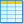

# The `BUILDING_INDICATORS` table

This table stores all the indicators computed at the building's scale.

 The indicators source code is available [here](https://github.com/orbisgis/geoclimate/blob/master/geoindicators/src/main/groovy/org/orbisgis/geoindicators/BuildingIndicators.groovy).

## Table definition 

 PK = Primary Key

| Field name   | Field type       | Definition         |
| :----------- | :--------------- | ------------------ |
| THE_GEOM       | geometry          | Building's geometry |
| **ID_BUILD**  | integer | Building's unique id |
| ID_SOURCE | varchar | Original unique id |
| ID_BLOCK | integer | Belonging block id |
| ID_RSU | integer | Belonging RSU id |
| HEIGHT_WALL | integer | Wall height |
| HEIGHT_ROOF | integer | Roof height |
| NB_LEV | integer | Number of level |
| TYPE | varchar | Building's type |
| MAIN_USE | varchar | Building's main use |
| ZINDEX | integer | Altimetric positioning ([Full definition](#ZINDEX)) |
| AREA | double precision | Building's area |
| VOLUME | double precision | Building's volume ([Full definition](#VOLUME)) |
| FLOOR_AREA | double precision | [Full definition](#FLOOR_AREA) |
| TOTAL_FACADE_LENGTH | double precision | [Full definition](#TOTAL_FACADE_LENGTH) |
| CONTIGUITY | double precision | [Full definition](#CONTIGUITY) |
| COMMON_WALL_FRACTION | double precision | [Full definition](#COMMON_WALL_FRACTION) |
| NUMBER_BUILDING_NEIGHBOR | bigint | [Full definition](#NUMBER_BUILDING_NEIGHBOR) |
| CONCAVITY | double precision | [Full definition](#CONCAVITY) |
| FORM_FACTOR | double precision | [Full definition](#FORM_FACTOR) |
| RAW_COMPACITY | double precision | [Full definition](#RAW_COMPACITY) |
| CONVEXHULL_PERIMETER_DENSITY | double precision | [Full definition](#CONVEXHULL_PERIMETER_DENSITY) |
| MINIMUM_BUILDING_SPACING | double precision | [Full definition](#MINIMUM_BUILDING_SPACING) |
| ROAD_DISTANCE | double precision | [Full definition](#ROAD_DISTANCE) |
| LIKELIHOOD_LARGE_BUILDING | double precision | [Full definition](#LIKELIHOOD_LARGE_BUILDING) |

## Indicators definition  

### `ZINDEX`

**Definition**: Position of the building relative to the ground. 0 means that the building is on the ground. A negative value means that it is under the ground *(e. g. a metro station)* while a value greater than 0 means that it is in the air *(e. g. a bridge)*.

### `VOLUME`

**Definition**: Building's volume defined as the product of the surface with the average height between the wall and the roof.

**Formula**: `Area * ((Wall height + Roof height)/2)`

**Source code**: https://github.com/orbisgis/geoclimate/blob/master/geoindicators/src/main/groovy/org/orbisgis/geoindicators/BuildingIndicators.groovy#L60

### `FLOOR_AREA`

**Definition**: Building's floor area as the product of the building’s area and the number of level.

**Formula**: `Area * Number of level`

**Source code**: https://github.com/orbisgis/geoclimate/blob/master/geoindicators/src/main/groovy/org/orbisgis/geoindicators/BuildingIndicators.groovy#L63

### `TOTAL_FACADE_LENGTH`

**Definition**: Total length of external facade, defined as the building’s external perimeter in addition to building courtyard(s) perimeter

**Formula**: `Perimeter + Courtyard perimeter `

**Source code**: https://github.com/orbisgis/geoclimate/blob/master/geoindicators/src/main/groovy/org/orbisgis/geoindicators/BuildingIndicators.groovy#L65

### `CONTIGUITY`

**Definition**: Fraction of wall shared with other buildings

Formula: `Shared wall area / total wall area `

sum(least(a_height_wall, b_height_wall)* st_length(the_geom)/(perimeter* a_height_wall)

Source code: https://github.com/orbisgis/geoclimate/blob/master/geoindicators/src/main/groovy/org/orbisgis/geoindicators/BuildingIndicators.groovy#L141

### `COMMON_WALL_FRACTION`

**Definition**: Fraction of linear of facade (also called “party walls”) shared with other buildings.

**Formula**: `Shared facade length / total facade length`

**Source code**: https://github.com/orbisgis/geoclimate/blob/master/geoindicators/src/main/groovy/org/orbisgis/geoindicators/BuildingIndicators.groovy#L145

### `NUMBER_BUILDING_NEIGHBOR`

**Definition**: Number of neighboring buildings, in contact (at least one point) with the building.

**Formula**: `Count the number of buildings touching the building of interest`

**Source code**: https://github.com/orbisgis/geoclimate/blob/master/geoindicators/src/main/groovy/org/orbisgis/geoindicators/BuildingIndicators.groovy#L108

### `CONCAVITY`

**Definition**: Calculates how close is a building from its smallest convex footprint.

**Formula**: `Area / Convex Hull area`

**Source code**: https://github.com/orbisgis/geoclimate/blob/master/geoindicators/src/main/groovy/org/orbisgis/geoindicators/BuildingIndicators.groovy#L237

### `FORM_FACTOR`

**Definition**: Ratio between the building’s area and the square of the building’s perimeter

**Formula**: `Area / (perimeter)^(1/2) `

**Source code**: https://github.com/orbisgis/geoclimate/blob/master/geoindicators/src/main/groovy/org/orbisgis/geoindicators/BuildingIndicators.groovy#L240

### `RAW_COMPACITY`

**Definition**: Ratio between building surfaces (walls and roof) and the building volume at the power 2/3. For the calculation, the roof is supposed to have a gable and the roof surface is calculated considering that the building is square (otherwise, the assumption related to the gable direction would strongly affect the result).

**Formula**: `(External walls area + courtyard walls area + roof area) / (volume^(2/3)) `

**Source code**: https://github.com/orbisgis/geoclimate/blob/master/geoindicators/src/main/groovy/org/orbisgis/geoindicators/BuildingIndicators.groovy#L243

### `CONVEXHULL_PERIMETER_DENSITY`

**Definition**: Ratio between building Convex Hull perimeter and building perimeter.

**Formula**: `Convex Hull perimeter / perimeter`

**Source code**: https://github.com/orbisgis/geoclimate/blob/master/geoindicators/src/main/groovy/org/orbisgis/geoindicators/BuildingIndicators.groovy#L250

### `MINIMUM_BUILDING_SPACING`

**Definition**: Building closest distance to an other building. A buffer of defined size (`bufferDist` argument, default 100 m) is used to get the buildings within the building of interest and then the minimum distance is calculated.

**Formula**: `Min(distance(building, other buildings within bufferDist))`

**Source code**: https://github.com/orbisgis/geoclimate/blob/master/geoindicators/src/main/groovy/org/orbisgis/geoindicators/BuildingIndicators.groovy#L281

### `ROAD_DISTANCE`

**Definition**: Building closest distance to a road. A buffer of defined size (`bufferDist` argument,  default 100m) is used to get the roads within the building of interest and then the minimum distance is calculated.

**Formula**: `Min(distance(building, roads within bufferDist))`

**Source code**: https://github.com/orbisgis/geoclimate/blob/master/geoindicators/src/main/groovy/org/orbisgis/geoindicators/BuildingIndicators.groovy#L338

### `LIKELIHOOD_LARGE_BUILDING`

**Definition**: Building closeness to a 50 m wide isolated building (where [NUMBER_BUILDING_NEIGHBOR](#NUMBER_BUILDING_NEIGHBOR) = 0). The step 9 of the manual decision tree for building type of the classification consists of checking whether buildings have a horizontal extent larger than 50 m. We therefore introduce an indicator which  measures the horizontal extent of buildings. This indicator is based on the largest side of the building  minimum rectangle. We use a logistic function to avoid threshold effects (e.g. totally different result for building sizes of 49 m and 51 m). The gamma and *x0* parameters in the logistic function are specified after analysis of the training data to identify the real size of the buildings classified as larger than 50 m in the subjective training process.

**Formula**: `xxxxxx`

**Source code**: https://github.com/orbisgis/geoclimate/blob/master/geoindicators/src/main/groovy/org/orbisgis/geoindicators/BuildingIndicators.groovy#L425