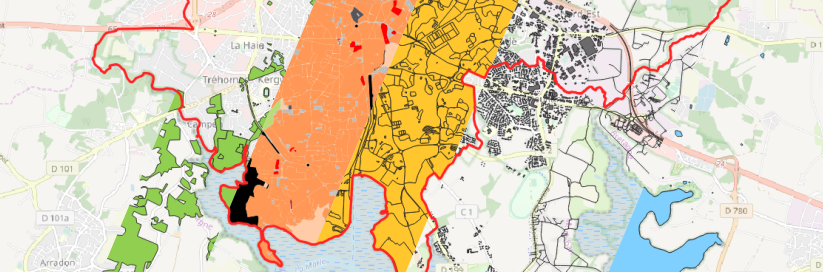

# Geoclimate

**A geospatial processing toolbox for environmental and climate studies**

GeoClimate documentation is available at https://geoclimate.readthedocs.io/en/latest/

**Note :**

**The documentation is inline with the current GeoClimate code source.**

**If you are using a released version of GeoClimate please read the documentation packaged with the version you are
using.**
