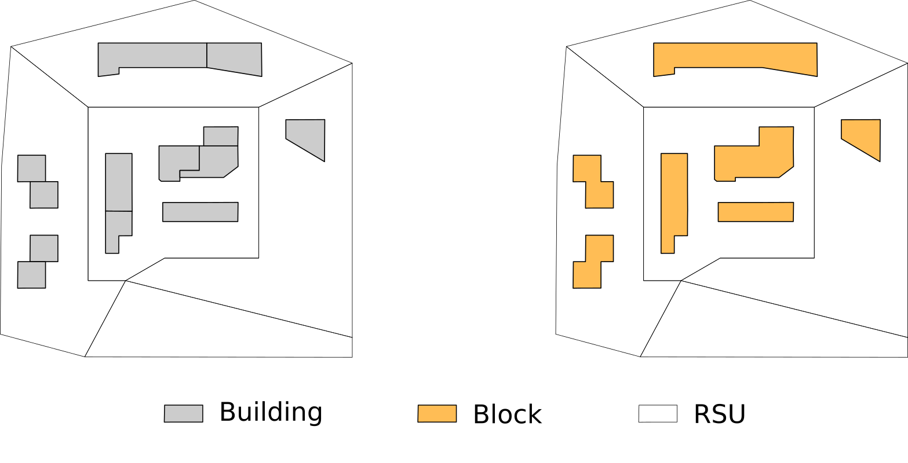
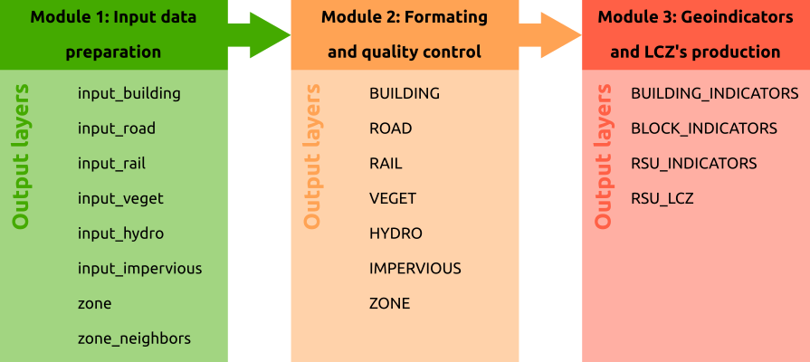

# Geoclimate documentation

**This documentation is under construction.**

## What is Geoclimate?

Geoclimate is a set of methods and spatial processing chains for extracting climate knowledge, at the city scale and on the basis of vector data.

## Why?

Even if many other applications are possible, the two main objectives of Geoclimate are: 

1. to feed the [TEB](http://www.umr-cnrm.fr/spip.php?article199) climate model developed by [Météo France](http://www.meteofrance.com),
2. to classify the urban tissues and build the *Local Climate Zones* ([LCZ](http://www.wudapt.org/lcz/)).

To achieve these objectives, it is necessary to calculate a large number of morphological and geographical indicators at different spatial scales.

Geoclimate has been developed with this in mind and offers a turnkey solution for users to compute:

- a series of more than 60 urban indicators at three spatial scales : RSU, block and building ([see](#Scales-of-analysis)),
- a LCZ classification, at the RSU scale.

## Scales of analysis

As described in [Bocher et al, 2018](http://dx.doi.org/10.1016/j.uclim.2018.01.008), three scales of analysis are used in Geoclimate:

- the **building**
- the **block** : a set of buildings that touches (at least one point in common)
- the ***Reference Spatial Unit***, also called RSU, which is a continuous and homogeneous way to divide the space, using topographic constraint such as roads, rail ways, big vegetation and hydrographic areas in addition to administrative boundaries.

On each of these scales, various indicators and analysis are processed.

## How it works?

The Geoclimate chain is made up of the 3 following modules:

### M1 - Input data preparation

The user chooses the data set of his choice and ensures that the information present corresponds to the ***Geoclimate input data model*** described [HERE](./input_data/INPUT_DATA_MODEL.md). So **M1 is feeding M2**.

 [Read more](./data_preparation/XXXXX.md) about this module.

### M2 - Formating and quality control

The prepared data provided by the user, according to the input model, are controlled and enriched on the basis of pre-established rules. So **M2 is feeding M3**.

 [Read more](./data_formating/DATA_FORMATING.md) about this module.

### M3 - Geoindicators and LCZ's production

The data are processed automatically, without user intervention, and the resulting layers are provided ([See](#Resulting-layers)).

### Remark

The user has the choice to merge or to skip M1 and M2. The only requirement is that the M3 input data must comply with the model defined [HERE](./input_data/INPUT_DATA_MODEL.md).

## Resulting layers

Depending on the options choosed by the user, the Geoclimate chain may produce various layers, described below:

| Table name            | Description                                                  | Documentation |
| :-------------------: | ------------------------------------------------------------ | :------: |
| `BUILDING_INDICATORS` | (geo)indicators at the building's scale |  [See](./results/BUILDING_INDICATORS.md) |
| `BLOCK_INDICATORS`                      | (geo)indicators at the block's scale |  [See](./results/BLOCK_INDICATORS.md) |
| `RSU_INDICATORS`                      | (geo)indicators at the RSU's scale                                                             |  [See](./results/RSU_INDICATORS.md) |
| `RSU_LCZ`                      | LCZ main and secondary types at the RSU's scale                                                             |  [See](./results/RSU_LCZ.md) |

## And technically?

In a technical point of view, the algorithms of the Geoclimate chain are implemented on top of the open source library [OrbisData](https://github.com/orbisgis/orbisdata). Orbisdata provides a unique access point to query, manage, retrieve data from a [PostGIS](https://postgis.net/) or a [H2GIS](http://www.h2gis.org/) database. Orbisdata is based on lambda expressions and sugar programming methods introduced since JAVA 8. Orbisdata is closed to [Groovy](https://groovy-lang.org/) syntax and provide an elegant and fluent framework to easily manage geospatial data. The processing chain is packaged in the [GeoClimate repository](https://github.com/orbisgis/geoclimate) available as a set of Groovy and SQL scripts.

## Use cases

Geoclimate has been developed in a modular and as generic way as possible. It is therefore possible for the user to use his own data sets, as long as he follows the instructions for their preparation / formatting.

Below we present two use cases developped by the Lab-STICC team: 

- [OpenStreetMap](https://www.openstreetmap.org) (OSM), on a worldwide context,
- BD Topo [V2.2](http://professionnels.ign.fr/ancienne-bdtopo) (from [IGN](http://ign.fr/)), only on the french scale.

