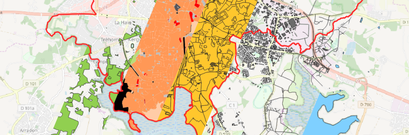

 

**A geospatial processing toolbox for environmental and climate studies**

GeoClimate documentation is available at https://geoclimate.readthedocs.io/en/latest/

> **⚠️ Note**
>
> The documentation is inline with the **current GeoClimate code source**.
>
> If you are using a **released version of GeoClimate**, please read the documentation packaged with the version you are using.

---

🌍 **GeoClimate: An Open Source Project Dedicated to Research!**

🔍 **Need help, advice, or want to report a bug?**

GeoClimate is an **open-source project developed primarily for research purposes**. 
Bug fixes and issue resolution depend on the **available time** of the team.

For any question, please specify:

✅ **Your use case** (research, teaching, personal project, commercial, etc.)

✅ **Your goals** (climate analysis, visualization, data processing, etc.)

🐞 **Reporting a bug?**
To help us fix it, please provide:
- The **version** of GeoClimate you are using
- **Steps to reproduce** the issue
- Your **environment** (OS, Java version, dependencies, etc.)

⚠️ **Note:** Fixes are prioritized based on available resources.

💼 **Need commercial or priority support?**
Contact us directly at: **info@orbisgis.org**

---

