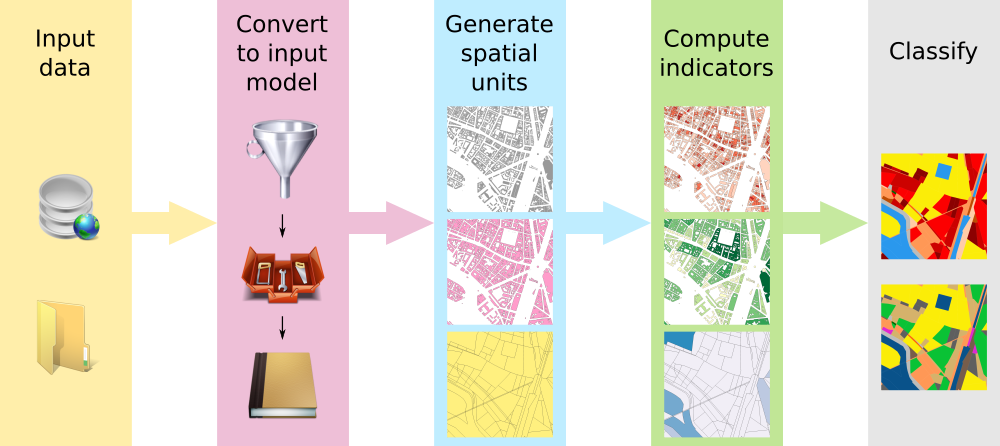

# Approach

The Geoclimate library is a collection of spatial processes (algorithms) that allows to compute **[indicators](./indicators/indicators.md)** such as form factor, densities, sky view factor... based on vector GIS layers. 

Computed for a specific **[spatial unit](./spatial_units/spatial_units.md)**, each indicators are then used in statistical **[classifications](./classsifications/classifications.md)** to categorize and extract shared properties or organizations for a studied area.

To do so, the vector GIS layers used by the algorithms must feed an **[input data model](./input_data_model.md)**. This model is organized around a set of thematic layers (building, road, railway, hydrography, vegetation)  which must follow a dictionary of values defining the name and type of columns as well as their constraints (min / max value, allowed string value to describe a feature, ...). 

The input data model guarantees the structure of the data sent to the Geoclimate processes while the input data formatting is performed to correct input values that would overpass the defined constraints. 

This approach can be summarized through the main bricks illustrated in the diagram below. In each of these bricks, a collection of processes are made available and usable *à la carte*, according to the user's needs and its available data.
The processes can be linked together in a tailor-made way by means of a **[workflow](./workflow/description.md)**.

Read more:

- [Input data model](./input_data_model.md)
- [Spatial units](./spatial_units/spatial_units.md)
- [Indicators](./indicators/indicators.md)
- [Classifications](./classsifications/classifications.md)

