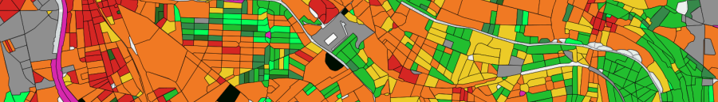

# Classifications

On the basis of the previously calculated [indicators](../indicators/indicators.md), we propose two classifications to segment the territory:

- [Local Climate Zones](./lcz.md)
- [Territorial typologogies](./territorial_typologies.md)

