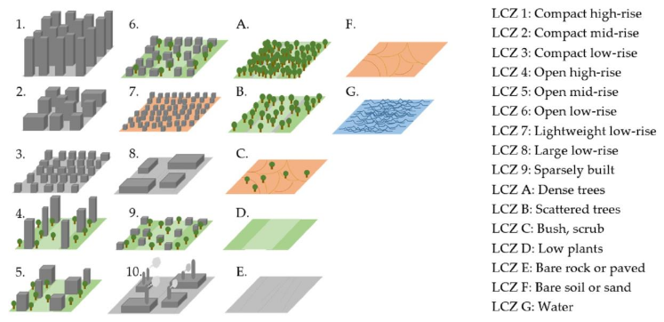
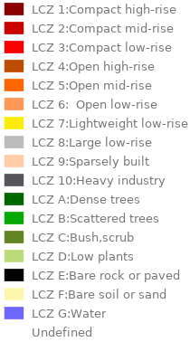

# Local Climate Zones classification

The *Local Climate Zones* (LCZ) types are computed at the RSU's scale.

The LCZ, introduced by *Stewart* & *Oke* ([2012](http://journals.ametsoc.org/doi/abs/10.1175/BAMS-D-11-00019.1), [2014](http://onlinelibrary.wiley.com/doi/10.1002/joc.3746/abstract)), is a classification scheme used to segment the climate area's of cities( and other).

## Methodology

A LCZ type is assigned to a RSU. This "assignment" is performed according to the 7 indicators used for LCZ classification (`sky_view_factor`, `aspect_ratio`, `building_surface_fraction`, `impervious_surface_fraction`, `pervious_surface_fraction`, `height_of_roughness_elements` and `terrain_roughness_class`). Each LCZ type has a given range for each of the 7 indicators. Then the method to find the LCZ type that is the most appropriate for a given RSU is based on the minimum distance (`MIN_DISTANCE`) to each LCZ (in the 7 dimensions space). In order to calculate this distance, each dimension is normalized according to the mean and the standard deviation (or median and absolute median deviation) of the interval values. Some of the indicators may be more important (or reliable) than the other for the LCZ identification. In order to manage this point, a map containing weights may be passed and will be used to multiply the distance due to a given indicator.

The distance of each RSU to each of the LCZ types is calculated in the normalized interval. The two LCZ types being the closest to the RSU indicators (`LCZ1` and `LCZ2`) are associated to this RSU. An indicator of uncertainty based on the *Perkin Skill Score* (`PSS`) method is also associated to this "assignment".

 The LCZ classification source code is available [here](https://github.com/orbisgis/geoclimate/blob/v1.0.0-RC1/geoindicators/src/main/groovy/org/orbisgis/geoindicators/TypologyClassification.groovy).

## Table definition 

 PK = Primary Key

| Field name                                                 | Field type       | Definition                   |
| :--------------------------------------------------------- | :--------------- | ---------------------------- |
| **ID_RSU**  | integer          | RSU's unique id              |
| LCZ1                                                       | integer          | Main LCZ type                |
| LCZ2                                                       | integer          | Secondary LCZ type           |
| MIN_DISTANCE                                               | double precision | Minimum distance to each LCZ |
| PSS                                                        | double precision | *Perkin Skill Score*         |

## LCZ typology

Below are presented the different LCZ types. 

For each of them, we give the definition and the hexadecimal color code used to display those informations.

| Type  |       Type definition       |                       Hexa Color code                        |
| :---: | :-------------------------: | :----------------------------------------------------------: |
|  `1`  |  LCZ 1: Compact high-rise   |  `#8b0101` |
|  `2`  |   LCZ 2: Compact mid-rise   |  `#cc0200` |
|  `3`  |   LCZ 3: Compact low-rise   |  `#fc0001` |
|  `4`  |    LCZ 4: Open high-rise    |  `#be4c03` |
|  `5`  |    LCZ 5: Open mid-rise     |  `#ff6602` |
|  `6`  |    LCZ 6: Open low-rise     |  `#ff9856` |
|  `7`  | LCZ 7: Lightweight low-rise |  `#fbed08` |
|  `8`  |    LCZ 8: Large low-rise    |  `#bcbcba` |
|  `9`  |    LCZ 9: Sparsely built    |  `#ffcca7` |
| `10`  |   LCZ 10: Heavy industry    |  `#57555a` |
| `101` |     LCZ A: Dense trees      |  `#006700` |
| `102` |   LCZ B: Scattered trees    |  `#05aa05` |
| `103` |      LCZ C: Bush,scrub      |  `#648423` |
| `104` |      LCZ D: Low plants      |  `#bbdb7a` |
| `105` |  LCZ E: Bare rock or paved  |  `#010101` |
| `106` |  LCZ F: Bare soil or sand   |  `#fdf6ae` |
| `107` |        LCZ G: Water         |  `#6d67fd` |

### Cartography

Two `.sld` style files, based on this classification, are provided in the `/processing_chain/src/main/resources/styles/` folder ([here](https://github.com/orbisgis/geoclimate/tree/v1.0.0-RC1/processingchain/src/main/resources/styles)):

- `lcz1.sld` : the style ready to be applied to the field `LCZ1`
- `lcz2.sld` : the style ready to be applied to the field `LCZ2`

