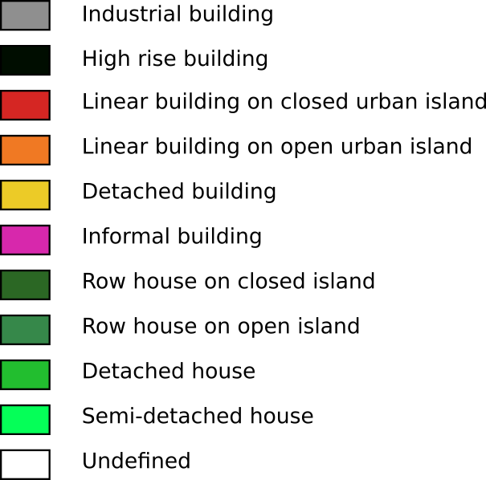

# Territorial typologies classification

Based on a random forest classification, this territorial typology aims *"to define a detailed description of buildings for urban climate and building energy consumption simulations"* ([Tornay *et al*. 2017](https://doi.org/10.1016/j.uclim.2017.03.002)).

This classification is computed at the RSU's scale.

## Typology

Below are presented the different territorial types. 

For each of them, we give the definition and the hexadecimal color code used to display those informations.

|  Type   |            Type definition            |                       Hexa Color code                        |
| :-----: | :-----------------------------------: | :----------------------------------------------------------: |
|  `ba`   |          Industrial building          |  `#8f8f8f` |
|  `bgh`  |          High-rise building           |  `#000d00` |
| `icif`  | Linear building on closed urban islet |  `#d52623` |
| `icio`  |  Linear building on open urban islet  |  `#f07923` |
|  `id`   |           Detached building           |  `#eccb27` |
| `local` |           Informal building           |  `#d728ac` |
| `pcif`  |       Row house on closed islet       |  `#2b6724` |
| `pcio`  |        Row house on open islet        |  `#36884a` |
|  `pd`   |            Detached house             |  `#22be2f` |
|  `psc`  |          Semi-detached house          |  `#05ff58` |
|         |               Undefined               |  `#ffffff` |

### Cartography

One `urban_typo.sld` style file, based on this classification, is provided in the `/processing_chain/src/main/resources/styles/` folder ([here](https://github.com/orbisgis/geoclimate/tree/v1.0.0-RC1/processingchain/src/main/resources/styles)).

