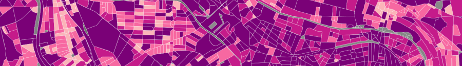

# Indicators

Geoclimate proposes more than 60 geospatial indicators computed at the three [spatial units](../spatial_units/spatial_units.md).

They are used to measure morphological properties (*e.g* the form factor), describe spatial organizations (*e.g.* distance measurements, patch metrics, shape index, spatial density, *etc*).
They are used to quantify the shape and pattern of urban and landscape structures.

Below are listed the three scales of indicators:

- [Building's indicators](./building.md)
- [Block's indicators](./block.md)
- [RSU's indicators](./rsu.md)

