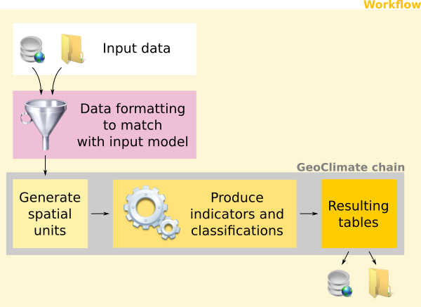

# Geoclimate description

The Geoclimate chain is a toolbox that makes it possible to carry out various tasks in an almost autonomous way.
In order to feed it, it is nevertheless necessary to carry out steps of preparation and formatting of the input data, depending on the chosen dataset (e.g OpenStreetMap, BD Topo, ...).

To control the whole, we propose a system called "workflow" which includes all these steps.

The approach is summarized in the illustration and detailed below:

- To enter Geoclimate, we have to match with the input data model,
- Then, the spatial units (blocks and RSUs) are created,
- Then, the indicators and the classification are calculated,
- Finally, the results are exported.

## Input data model

To operate the Geoclimate chain, the input data have to respect a model that is described [here](./input_data_model.md).

## Spatial units

As described in [Bocher et al, 2018](http://dx.doi.org/10.1016/j.uclim.2018.01.008), three scales of analysis are used in Geoclimate:

- the **building**
- the **block**: a set of buildings that touches (at least one point in common) ([see how it's made](./spatial_units/block.md))
- the ***Reference Spatial Unit***, also called  RSU, which is a continuous and homogeneous way to divide the space,  using topographic constraint such as roads, rail ways, big vegetation and hydrographic areas in addition to administrative boundaries ([see how it's made](./spatial_units/rsu.md)).

## Indicators

More than 60 (geo)indicators are computed within the Geoclimate chain. They are grouped by theme and presented below: 

- [Building's indicators](./indicators/building.md)
- [Block's indicators](./indicators/block.md)
- [RSU's indicators](./indicators/rsu.md)
- [RSU's classifications](./indicators/rsu_classifications.md)

 

## Implementation

l'implémentation "technique" -> [implementation](./implementation.md)

## Workflow

In practice, in order to make the chain work as a whole, a user will rely on a workflow. 
In the form of a script, the workflow allows the different steps specific to Geoclimate to be chained together, but also and above all those upstream allowing the preparation of data and those at the output allowing the export of results.

Read more [here](./workflow/description.md).

