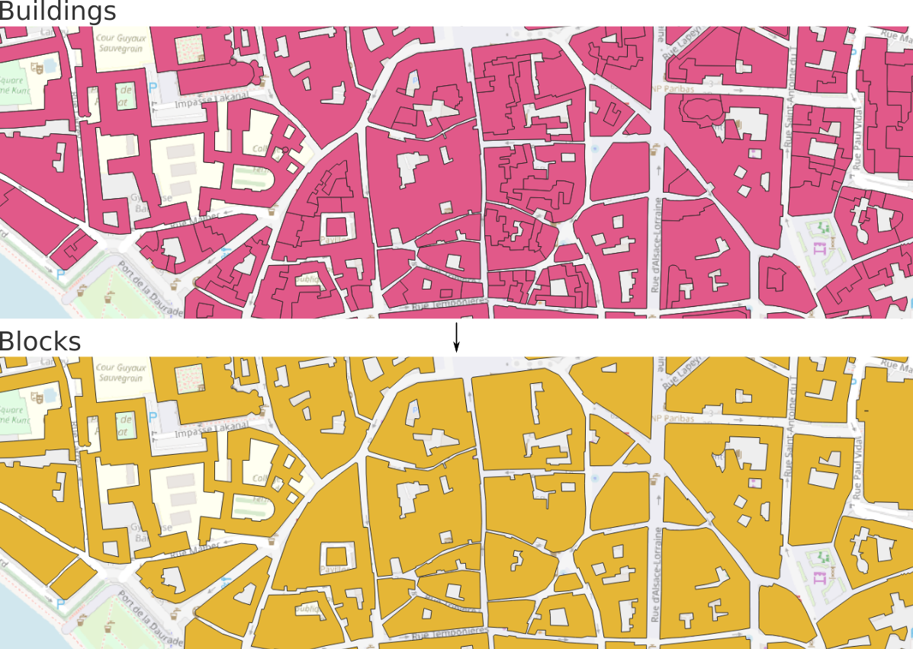

# Spatial unit - Block 

## Definition

A block is a geometry made of buildings in contact.

We consider that two buildings are in contact as soon as they have at least one point in common (they can therefore also have a common line or surface).

## Illustration

Below is an illustration, in the city center of [Toulouse](https://www.openstreetmap.org/#map=18/43.60358/1.44427) (France) (on top of an OpenStreetMap basemap).

## Source code

You can consult the source code [here](https://github.com/orbisgis/geoclimate/blob/master/geoindicators/src/main/groovy/org/orbisgis/orbisprocess/geoclimate/geoindicators/SpatialUnits.groovy).