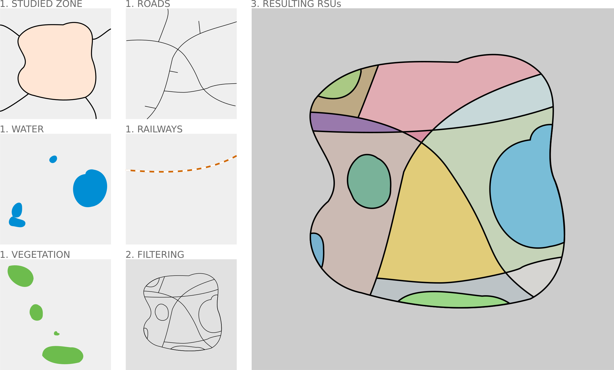
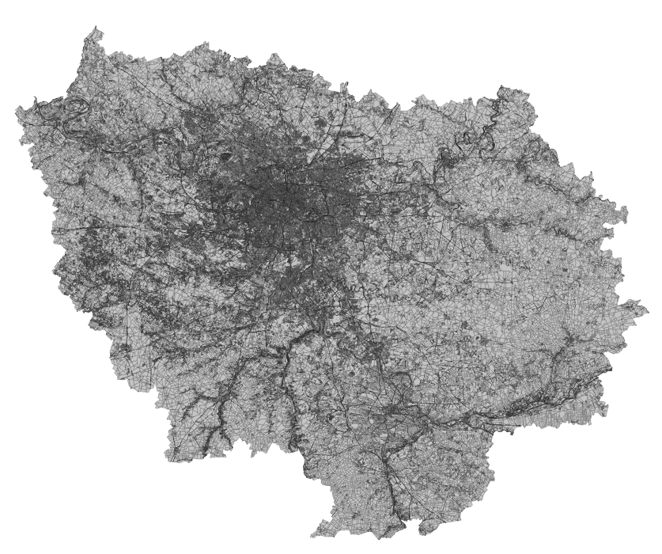
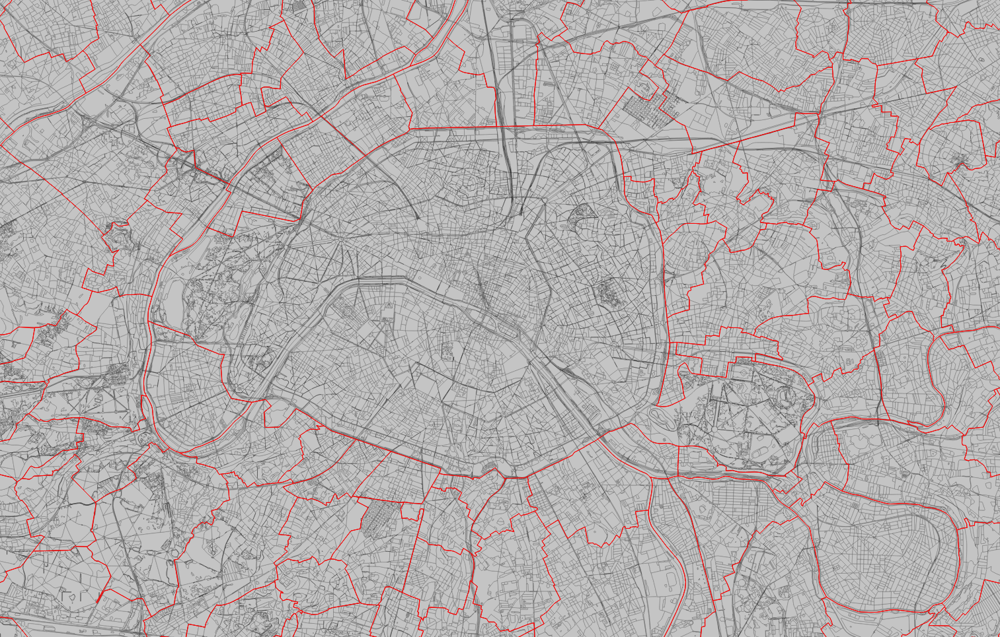

# Spatial unit - RSU

## Definition

RSU stands for "Reference Spatial Unit". This spatial scale, which was introduced as part of the MAPUCE project (see Bocher), was initially based on the cadastral plots.

In the framework of Geoclimate, we have redesigned the definition of the RSU by integrating new constraints to define its geometry. Thus, a RSU is now defined as follows:

A RSU is the smallest area bounded by
- the zone
- the road network
- railways
- large water surfaces
- large vegetation surfaces

## Constraints

### Road

We only keep the roads that respects these constraints: 

- the main roads
  - For OSM use case: **XXXXX**
  - For BD Topo v2 use case: we are only considering the objects where `NATURE` = `Route à 2
    chaussées` / `Route empierrée` / `Route à 1 chaussée` / `Bretelle` / `Quasi-autoroute` /
    `Autoroute` / `Chemin`
- `ZINDEX` = 0 (so bridges (`ZINDEX`=1), tunnels (`ZINDEX`=-1), ... are excluded)

### Railway

We only keep the railways that respects these constraints: 

- the main railways. So the service railways are excluded
  - For OSM use case: **XXXXX**
  - For BD Topo v2 use case: we are only considering the objects where `NATURE` = `Principale`

- `ZINDEX` = 0 (so bridges (`ZINDEX`=1), tunnels (`ZINDEX`=-1), ... are excluded)

### Hydrography

Only the large water zones are taken into account. The threshold that determines whether a zone is large or not is based on a parameter named `surface_hydro`. By default, this threshold is set to 2,500 square meters.

To find out whether or not a water zone will be selected, we proceed as follows:

- the water areas that touch each other are unified. We then obtain blocks of water,
  - blocks whose surface area is greater than the threshold `surface_hydro` are used as geometric constraint.

### Vegetation

Only the large vegetation zones are taken into account. The threshold that determines whether a zone is large or not is based on a parameter named `surface_vegetation`. By default, this threshold is set to 100,000 square meters.

To find out whether or not a vegetation zone will be selected, we proceed as follows:
- the vegetation areas that touch each other are unified. We then obtain blocks of vegetation,
  - blocks whose surface area is greater than the threshold `surface_vegetation` are used as geometric constraint.

## Process

To create the RSUs, we are proceeding as follows:

1. The large vegetation and water areas are created
2. The preserved objects (see the [contraints](#constraints)) are converted into single lines, overlayed and then intersected.
3. These multiple sub-divided lines are then converted into polygons

## Illustrations

Below are examples of RSU's, produced in the region of Paris (France), using data from BD Topo v2.

#### RSUs in the [Ile-de-France region](https://www.openstreetmap.org/relation/8649)

#### RSUs zoomed on Paris (cities boundaries in red)

## Source code

You can consult the source code [here](https://github.com/orbisgis/geoclimate/blob/master/geoindicators/src/main/groovy/org/orbisgis/orbisprocess/geoclimate/geoindicators/SpatialUnits.groovy).