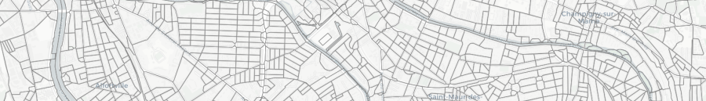

# Spatial units

Geoclimate performs indicator computation at three spatial units.

A spatial unit corresponds to a geometry area (`POLYGON` or `MULTIPOLYGON`). It qualifies the best representing spatial object to compile geographical properties and characteristics. The spatial units stands for a nested spatial relationship where the building is the lowest common feature denominator as described in [Bocher et al, 2018](http://dx.doi.org/10.1016/j.uclim.2018.01.008).

- the **building**, a collection of features that represent structures with a roof and walls, such as a house or factory,
- the **[block](./block.md)** : a set of buildings that touches (at least one point in common),
- the ***[Reference Spatial Unit](./rsu.md)***, also called  RSU, which is a continuous and homogeneous way to divide the space,  using topographic constraint such as roads, railways, vegetation and water areas in addition to administrative boundaries.

