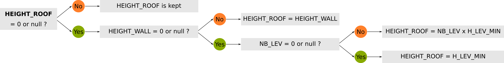

# BD Topo v2 - Data formating

The purpose of this module is to format the data coming from the "preparation" module (M1) in order to feed the Geoclimate chain. As such, it allows the following two tasks in particular:
- [enrich the data](#Data-enrichment), in particular when there is missing values, based on pre-established rules. It concerns the add of a [primary key](#primary-key-) to input tables as well as the rules on [buildings](#building-rules-), [roads](#road-rules-) and [vegetation](#vegetation-rules-) surfaces.

- [control data quality](#Quality-controls), on [buildings](#On-buildings), [roads](#On-roads), [railways](#On-railways), [vegetation areas](#On-vegetation-areas) and [hydrographic areas](#On-hydrographic-areas) layers.

  

## Data enrichment

### Primary Key 

All the `input_table` coming from M1 have to have an `id_source` column, that identify the input object. Since this *id* is stored as a text value (`VARCHAR`) we prefer to add a new unique and optimized *id* called `id_xxxx` (with `xxxx` the name of the layer - *e.g* `id_building`) and stored as a numeric (INTEGER /  SERIAL). In the same time, the [PRIMARY KEY](#https://www.w3schools.com/sql/sql_primarykey.asp) constraint is added in order to create an `INDEX` on this column (will be useful for the following processes).

### Building rules 

#### 1- Belonging zone Id

Since the input buildings are selected on a larger area than the studied zone (see [`ZONE`](../input_data/INPUT_DATA_MODEL.md#Zones) layer), we're going to have buildings:
- inside the study area, 
- outside the study area,
- or straddling one or more areas.

For the optimization of upcoming processes, it is necessary to assign to each building the id (`id_zone`) of the belonging zone.

To determine this matching, we apply the "*maximum area*" rule, defined as follows:

> The building is associated to the zone with which it has the largest intersection area 

After applying this rule, a building can only be inside or outside the zone. Consequently, we can assign the following value:

| The building is  | Value assigned in the field `id_zone` |
| :--------------: | :-----------------------------------: |
| Inside the zone  |  the zone id (INSEE Code in France)   |
| Outside the zone |               `outside`               |

#### 2- HEIGHTs and Number of levels 

In the layer `input_building` coming from M1, the fields `HEIGHT_WALL`, `HEIGHT_ROOF` and `NB_LEV` may have null values. For the upcoming processes (e.g when calculating morphological indicators), it may causes problems. So to resolve this issue, we propose a set of logical rules in order to deduce probable values, using `type` and potentially existing informations in the fields `HEIGHT_WALL`, `HEIGHT_ROOF` and `NB_LEV`.

##### BUILDING level *vs* type

These logical rules will depends on the building `type`. Indeed, we consider that a castle, a commercial area or a house should not be considered in the same way.

So, for each individual value concerning the building `type`  (values listed in the [BUILDING_use and type](../input_data/INPUT_DATA_MODEL.md#-building-use-and-type) section), the following list specifies the rules for calculating the number of levels of a building in order to feed the `nb_lvl` field in the `input_building` table.

- **Type**: value used to describe the building `type`
- **Nb_lev_rule**: Specifies whether or not the building type is taken into account when calculating the number of levels:
  - `0` = not taken into account: in this case, the number of levels will be forced to 1,
  - `1` = taken into account: in this case, a formula will be used to deduce the number,
  - `2` = other situtation : we apply a specific rule.

|              Type               | Nb_lev_rule |
| :-----------------------------: | :---------: |
|            building             |      1      |
|              house              |      1      |
|            detached             |      1      |
|           residential           |      1      |
|           apartments            |      1      |
|            bungalow             |      0      |
|            historic             |      0      |
|            monument             |      0      |
|              ruins              |      0      |
|             castle              |      0      |
|          agricultural           |      0      |
|              farm               |      0      |
|         farm_auxiliary          |      0      |
|              barn               |      0      |
|           greenhouse            |      0      |
|              silo               |      0      |
|           commercial            |      2      |
|           industrial            |      0      |
|              sport              |      0      |
|          sports_centre          |      0      |
|           grandstand            |      0      |
|         transportation          |      0      |
|          train_station          |      0      |
|           toll_booth            |      0      |
|            terminal             |      0      |
|           healthcare            |      1      |
|            education            |      1      |
| entertainment, arts and culture |      0      |
|           sustenance            |      1      |
|            military             |      0      |
|            religious            |      0      |
|             chapel              |      0      |
|             church              |      0      |
|           government            |      1      |
|            townhall             |      1      |
|             office              |      1      |

##### Logical rules

The logical rules, presented below, are applied in the following order:

1. HEIGH_WALL
2. HEIGH_ROOF 
3. NB_LEV
4. Control

→1. **HEIGH_WALL**: This rule is applied to any kind of buildings

→ 2. **HEIGHT_ROOF**: This rule is applied to any kind of buildings

→ 3. **NB_LEV**: This rule is applied only if: 

- [`Nb_lev_rule`](#BUILDING-level-vs-type) = `1`  **or** 

- [`Nb_lev_rule`](#BUILDING-level-vs-type) = `2` and `HEIGHT_WALL` > `10`m

Else, `NB_LEV` is forced to `1`.

→4. **Control**

Once the 3 columns (`HEIGHT_WALL`, `HEIGHT_ROOF` and `NB_LEV`) have been updated, we carry out a final 3 steps control  (C1, C2 and C3) phase to eliminate possible outliers.

C1: Check if `HEIGHT_ROOF` is lower than `HEIGHT_WALL`

C2: Check if there is a high difference beetween the "real" and "theorical" roof heights (`HEIGHT_ROOF`), based on the following parameter:

- `H_LEV_MIN`: indicates the theoretical minimum height of a level (default = 3m)

C3: Check if there is a high difference beetween the "real" and "theorical" number of levels (`NB_LEV`), based on the following parameters:

- `H_LEV_MIN`: indicates the theoretical minimum height of a level (default = 3m)
- `H_LEV_MAX`: indicates the theoretical maximum height of a level (default = 15m)

This control is applied only if: 

- [`Nb_lev_rule`](#BUILDING-level-vs-type) = `1`  **or** 

- [`Nb_lev_rule`](#BUILDING-level-vs-type) = `2` and `HEIGHT_WALL` > `10`m

Else, `NB_LEV` is kept.

#### 3- Z Index

If the `ZINDEX` is `null`, then it's initialized to `0`.

[back to top](#BD-Topo-v2---Data-formating)

### Road rules 

#### Width 

To calculates indicators such as the `GROUND_ROAD_FRACTION` ([See](../../indicators/rsu.md)), it is necessary to use the `width` column in the `input_road` layer. In case this information is missing in the input data, we deduce it from the road `type` (values listed in the [ROAD type](../input_data/INPUT_DATA_MODEL.md#-road-type) section) using the following matching table, where:

- **Type**: value used to qualify the `type` of the road
- **Min_width**: minimum road width *(expressed in meter)* to apply, if no information provided

|     Type     | Min_width |
| :----------: | :-------: |
| residential  |     8     |
|    track     |     2     |
| unclassified |     3     |
|   footway    |     1     |
|     path     |     1     |
|   tertiary   |     8     |
|  secondary   |    10     |
|   primary    |    10     |
|   cycleway   |     1     |
|    trunk     |    16     |
|    steps     |     1     |
|   motorway   |    24     |
| highway_link |     8     |
|  roundabout  |     4     |
|   highway    |     8     |
|    ferry     |     0     |

[back to top](#BD-Topo-v2---Data-formating)

### Vegetation rules 

#### Height class 

For climate models purposes, it is necessary to distinguish between `high` and `low` vegetation areas. Since this information is generally not available in the input data, we deduce it from the vegetation `type` (values listed in the [VEGET type](../input_data/INPUT_DATA_MODEL.md#-veget-type) section).

The table below gives the correspondences between the `type` and the expected height class (`height_class` attribute) in the `input_veget` table.

|     Type      | Height class |
| :-----------: | :----------: |
|     tree      |     high     |
|     wood      |     high     |
|    forest     |     high     |
|     scrub     |     low      |
|   grassland   |     low      |
|     heath     |     low      |
|   tree_row    |     high     |
|     hedge     |     high     |
|   mangrove    |     high     |
|    orchard    |     high     |
|   vineyard    |     low      |
| banana_plants |     high     |
|  sugar_cane   |     low      |

[back to top](#BD-Topo-v2---Data-formating)

## Quality controls

In order to have a view on the input data quality, before and after the application of the [rules](#Data-enrichment) seen above, we propose a series of controls listed below.

### On buildings

- The controls are made twice, on two spatial scales : zone level / buffer zone level.
- The controls are made in two steps : before / after the update of `HEIGHT_WALL`. They are then merged into a common table called `BUILDING_STATS_ZONE` or `BUILDING_STATS_EXT_ZONE` depending the spatial scale of analysis.

Below are listed the controls (with their column names) made:

|     Column      | Description                                                  |
| :-------------: | ------------------------------------------------------------ |
|     ID_ZONE     | Belonging zone id                                            |
|    NB_BUILD     | Number of building in the studied area *(zone or buffer zone)* |
|    NOT_VALID    | Number of invalid geometries *(thanks to [ST_IsValid](http://www.h2gis.org/docs/dev/ST_IsValid/) function)* |
|    IS_EMPTY     | Number of empty geometries *(thanks to [ST_IsValid](http://www.h2gis.org/docs/dev/ST_IsEmpty/) function)* |
|    IS_EQUALS    | Number of equal geometries *(thanks to [ST_Equals](http://www.h2gis.org/docs/dev/ST_Equals/) function)* |
|     OVERLAP     | Number of overlapping geometries *(thanks to [ST_Overlaps](http://www.h2gis.org/docs/dev/ST_Overlaps/) function)* |
|    FC_H_ZERO    | Number of building where `HEIGHT_WALL`= 0 *(FC = First control →before the enrichment [rules](#Data-enrichment))* |
|    FC_H_NULL    | Number of building where `HEIGHT_WALL` is null *(FC)*        |
|   FC_H_RANGE    | Number of building where `HEIGHT_WALL` < 0 or `HEIGHT_WALL` > 1000 *(FC)* |
|     H_NULL      | Number of building where `HEIGHT_WALL` is null *(SC = Second control →after the enrichment [rules](#Data-enrichment))* |
|     H_RANGE     | Number of building where `HEIGHT_WALL` < 0 or `HEIGHT_WALL` > 1000 *(SC)* |
| H_ROOF_MIN_WALL | Number of building with a roof height lower than wall height *(SC)* |
|    LEV_NULL     | Number of building where `NB_LEV` is null *(SC)*             |
|    LEV_RANGE    | Number of building where `NB_LEV` <1  and `NB_LEV` > 200 *(SC)* |
|     NO_TYPE     | Number of building with no `type`                            |
|   TYPE_RANGE    | Number of building where the `type` is not defined in the "[expected list](../input_data/INPUT_DATA_MODEL.md#-building-use-and-type)" |

[back to top](#BD-Topo-v2---Data-formating)

### On roads

- The controls are made twice, on two spatial scales : zone level / buffer zone level.
- The controls are made in two steps : before / after the update of `WIDTH`. They are then merged into a common table called `ROAD_STATS_ZONE` or `ROAD_STATS_EXT_ZONE` depending the spatial scale of analysis.

Below are listed the controls (with their column names) made:

|   Column   | Description                                                  |
| :--------: | ------------------------------------------------------------ |
|  ID_ZONE   | Belonging zone id                                            |
|  NB_ROAD   | Number of road in the studied area *(zone or buffer zone)*   |
| NOT_VALID  | Number of invalid geometries *(thanks to [ST_IsValid](http://www.h2gis.org/docs/dev/ST_IsValid/) function)* |
|  IS_EMPTY  | Number of empty geometries *(thanks to [ST_IsValid](http://www.h2gis.org/docs/dev/ST_IsEmpty/) function)* |
| IS_EQUALS  | Number of equal geometries *(thanks to [ST_Equals](http://www.h2gis.org/docs/dev/ST_Equals/) function)* |
|  OVERLAP   | Number of overlapping geometries *(thanks to [ST_Overlaps](http://www.h2gis.org/docs/dev/ST_Overlaps/) function)* |
| FC_W_ZERO  | Number of road where `WIDTH`= 0 *(FC = First control →before the enrichment [rules](#Data-enrichment))* |
| FC_W_NULL  | Number of road where `WIDTH`is null *(FC)*                   |
| FC_W_RANGE | Number of road where `WIDTH` < 0 or `WIDTH` > 100 *(FC)*     |
|   W_NULL   | Number of road where `WIDTH`is null *(SC = Second control →after the enrichment [rules](#Data-enrichment))* |
|  W_RANGE   | Number of road where `WIDTH` < 0 or `WIDTH` > 100 *(SC)*     |
|  NO_TYPE   | Number of road with no `type`                                |
| TYPE_RANGE | Number of road where the `type` is not defined in the "[expected list](../input_data/INPUT_DATA_MODEL.md#-road-type)" |

[back to top](#BD-Topo-v2---Data-formating)

### On railways

- The controls are made once, on the zone level.
- The controls are made in one steps since no enrichment rules have been applied. They are stored in table called `RAIL_STATS_ZONE`.

Below are listed the controls (with their column names) made:

|   Column   | Description                                                  |
| :--------: | ------------------------------------------------------------ |
|  ID_ZONE   | Belonging zone id                                            |
|  NB_RAIL   | Number of railways in the studied zone                       |
| NOT_VALID  | Number of invalid geometries *(thanks to [ST_IsValid](http://www.h2gis.org/docs/dev/ST_IsValid/) function)* |
|  IS_EMPTY  | Number of empty geometries *(thanks to [ST_IsValid](http://www.h2gis.org/docs/dev/ST_IsEmpty/) function)* |
| IS_EQUALS  | Number of equal geometries *(thanks to [ST_Equals](http://www.h2gis.org/docs/dev/ST_Equals/) function)* |
|  OVERLAP   | Number of overlapping geometries *(thanks to [ST_Overlaps](http://www.h2gis.org/docs/dev/ST_Overlaps/) function)* |
|  NO_TYPE   | Number of railways with no `type`                            |
| TYPE_RANGE | Number of railways where the `type` is not defined in the "[expected list](../input_data/INPUT_DATA_MODEL.md#-rail-type)" |

[back to top](#BD-Topo-v2---Data-formating)

### On vegetation areas

- The controls are made twice, on two spatial scales : zone level / extended zone level.
- The controls are made in one step and are stored in two table called `VEGET_STATS_ZONE` or `VEGET_STATS_EXT_ZONE` depending the spatial scale of analysis.

Below are listed the controls (with their column names) made:

|   Column   | Description                                                  |
| :--------: | ------------------------------------------------------------ |
|  ID_ZONE   | Belonging zone id                                            |
|  NB_VEGET  | Number of vegetation areas in the studied zone *(zone or extended zone)* |
| NOT_VALID  | Number of invalid geometries *(thanks to [ST_IsValid](http://www.h2gis.org/docs/dev/ST_IsValid/) function)* |
|  IS_EMPTY  | Number of empty geometries *(thanks to [ST_IsValid](http://www.h2gis.org/docs/dev/ST_IsEmpty/) function)* |
| IS_EQUALS  | Number of equal geometries *(thanks to [ST_Equals](http://www.h2gis.org/docs/dev/ST_Equals/) function)* |
|  OVERLAP   | Number of overlapping geometries *(thanks to [ST_Overlaps](http://www.h2gis.org/docs/dev/ST_Overlaps/) function)* |
|  NO_TYPE   | Number of vegetation areas with no `type`                    |
| TYPE_RANGE | Number of vegetation areas where the `type` is not defined in the "[expected list](../input_data/INPUT_DATA_MODEL.md#-veget-type)" |

[back to top](#BD-Topo-v2---Data-formating)

### On hydrographic areas

- The controls are made twice, on two spatial scales : zone level / extended zone level.
- The controls are made in one step and are stored in two table called `HYDRO_STATS_ZONE` or `HYDRO_STATS_EXT_ZONE` depending the spatial scale of analysis.

Below are listed the controls (with their column names) made:

|  Column   | Description                                                  |
| :-------: | ------------------------------------------------------------ |
|  ID_ZONE  | Belonging zone id                                            |
| NB_HYDRO  | Number of hydrographic areas in the studied zone *(zone or extended zone)* |
| NOT_VALID | Number of invalid geometries *(thanks to [ST_IsValid](http://www.h2gis.org/docs/dev/ST_IsValid/) function)* |
| IS_EMPTY  | Number of empty geometries *(thanks to [ST_IsValid](http://www.h2gis.org/docs/dev/ST_IsEmpty/) function)* |
| IS_EQUALS | Number of equal geometries *(thanks to [ST_Equals](http://www.h2gis.org/docs/dev/ST_Equals/) function)* |
|  OVERLAP  | Number of overlapping geometries *(thanks to [ST_Overlaps](http://www.h2gis.org/docs/dev/ST_Overlaps/) function)* |

[back to top](#BD-Topo-v2---Data-formating)