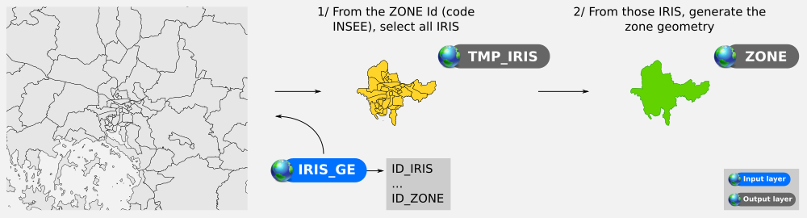
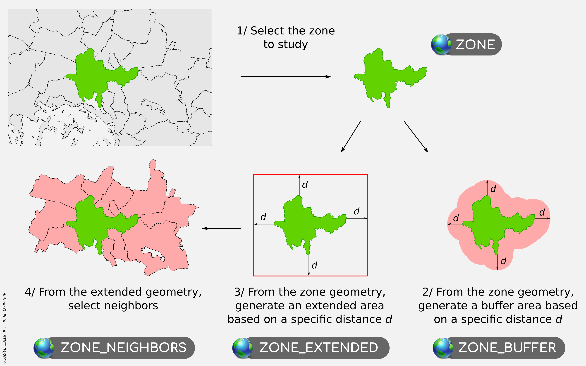

# BD Topo v2 - Data preparation

This module consists in extracting and preparing the data chosen by the user for integration into the formating step (see [Module 2](./data_formating.md)).
In particular, it allows:

- the selection of the necessary input data, based on spatial filters,
- the compliance of the thematic descriptors.

## Input layers

### Zone layer

As explained beforehand, we will process the BD Topo zone by zone. In this example, the `ZONE` will be a French city.

In the meantime, for the purposes of the [PAENDORA](https://www.ademe.fr/sites/default/files/assets/documents/aprademeprojetsretenusen2017.pdf#page=39) project in which this example is included, we need to combine Geoclimate results with population data. In France, this kind of information is commonly provided at the [IRIS](https://www.insee.fr/fr/metadonnees/definition/c1523) scale. An IRIS (Ilots Regroupés pour l’Information Statistique - grouped islets for the statistical information) is a basic spatial scale for the dissemination of local data such as population statistics, household consumption, professional social categories, ...

#### IRIS *vs* city

A city can consist of 1 to *n* IRIS and an IRIS belongs to only one city. So by merging IRIS geometries (in a temporary table called `TMP_IRIS`) that have a common city Id (nammed `CODE_INSEE` - `ID_ZONE`), we can generate the city (`ZONE`) shape.

#### Input data

In this use case, we use the [`IRIS_GE`](http://professionnels.ign.fr/irisge) layer produced by the IGN, mainly because the geometries are consistent with the one from BD Topo.

|                 IRIS layer name                  | Input data model matching |
| :----------------------------------------------: | :-----------------------: |
| [`IRIS_GE`](http://professionnels.ign.fr/irisge) |           ZONE            |

### Thematic layers

Below are listed the BD Topo v2 layers used to feed the [input data model](../../input_data_model.md).

|                      BD Topo layer name                      | Temporary table name in M1 | Input data model matching |
| :----------------------------------------------------------: | :------------------------: | :-----------------------: |
| [BATI_INDIFFERENCIE](http://professionnels.ign.fr/doc/DC_BDTOPO_2.pdf#page=80) |       input_building       |         BUILDING          |
| [BATI_INDUSTRIEL](http://professionnels.ign.fr/doc/DC_BDTOPO_2.pdf#page=89) |       input_building       |         BUILDING          |
| [BATI_REMARQUABLE](http://professionnels.ign.fr/doc/DC_BDTOPO_2.pdf#page=85) |       input_building       |         BUILDING          |
| [ROUTE](http://professionnels.ign.fr/doc/DC_BDTOPO_2.pdf#page=13) |         input_road         |           ROAD            |
| [TRONCON_VOIE_FERREE](http://professionnels.ign.fr/doc/DC_BDTOPO_2.pdf#page=44) |         input_rail         |           RAIL            |
| [ZONE_VEGETATION](http://professionnels.ign.fr/doc/DC_BDTOPO_2.pdf#page=116) |        input_veget         |           VEGET           |
| [SURFACE_EAU](http://professionnels.ign.fr/doc/DC_BDTOPO_2.pdf#page=66) |        input_hydro         |           HYDRO           |
| [TERRAIN_SPORT](http://professionnels.ign.fr/doc/DC_BDTOPO_2.pdf#page=103) |      input_impervious      |        IMPERVIOUS         |
| [CONSTRUCTION_SURFACIQUE](http://professionnels.ign.fr/doc/DC_BDTOPO_2.pdf#page=113) |      input_impervious      |        IMPERVIOUS         |
| [SURFACE_ROUTE](http://professionnels.ign.fr/doc/DC_BDTOPO_2.pdf#page=35) |      input_impervious      |        IMPERVIOUS         |
| [SURFACE_ACTIVITE](http://professionnels.ign.fr/doc/DC_BDTOPO_2.pdf#page=134) |      input_impervious      |        IMPERVIOUS         |

[back to top](#BD-Topo-v2---Data-extraction)

## Spatial filtering

Spatial filtering consists in reducing the number of input objects based on areas deduced from the study area.

Below are presented:
- the different working areas,
- the conditions for filtering input data according to the working zones.

### Working areas

|       Name       | Description                                                  |
| :--------------: | ------------------------------------------------------------ |
|      `ZONE`      | The studied zone, which may be a city, an agglomeration, ... |
|  `ZONE_BUFFER`   | A buffer area around the `ZONE` . The size *(expressed in meter)* is defined with the `DIST_BUFFER` parameter. Default value = `500`m |
| `ZONE_EXTENDED`  | An extended area around the `ZONE` , produce with the [ST_Expand](http://www.h2gis.org/docs/dev/ST_Expand/) operator. The size *(expressed in meter)* is defined with the `EXPAND` parameter. Default value = `1000`m |
| `ZONE_NEIGHBORS` | The neighboring zones. A zone is considered to be a neighbor if it intersects the `ZONE_EXTENDED`. This zone is only used to determine the relationship between buildings and their belonging zones ([See](../data_formating/DATA_FORMATING.md#1--belonging-zone-id)). |

**Remark**

- `ZONE` layer is expected in the [input data model](../../../input_data_model.md#zones).
- `ZONE_BUFFER` , `ZONE_EXTENDED` and `ZONE_NEIGHBORS` are temporary layers, just needed for this extraction step.

### Input data *vs* working areas

Depending on the working zones, the input data are selected. The table below list the conditions of selection:

|       Theme        |              ZONE              |          ZONE_BUFFER           |         ZONE_EXTENDED          |
| :----------------: | :----------------------------: | :----------------------------: | :----------------------------: |
|     Buildings      |                                |  |                                |
|       Roads        |                                |  |                                |
|      Railways      |  |                                |                                |
|  Vegetation areas  |                                |                                |  |
| Hydrographic areas |                                |                                |  |
|  Impervious areas  |  |                                |                                |

[back to top](#BD-Topo-v2---Data-extraction)

## Attribute filtering

In some cases, it is necessary to filter the input data, in order to keep only needed informations.

Below we are detailing for all layers from BD Topo wether a filter is applied or not (in this case, every objects are kept).

|   BD Topo layer name    |                           Filter ?                           |
| :---------------------: | :----------------------------------------------------------: |
|   BATI_INDIFFERENCIE    |                          no filter                           |
|     BATI_INDUSTRIEL     |                          no filter                           |
|    BATI_REMARQUABLE     |                          no filter                           |
|          ROUTE          | where [`POS_SOL`](http://professionnels.ign.fr/doc/DC_BDTOPO_2.pdf#page=23) >= 0 |
|   TRONCON_VOIE_FERREE   | where [`POS_SOL`](http://professionnels.ign.fr/doc/DC_BDTOPO_2.pdf#page=47) >= 0 |
|     ZONE_VEGETATION     |                          no filter                           |
|       SURFACE_EAU       |                          no filter                           |
|      TERRAIN_SPORT      | where [`NATURE`](http://professionnels.ign.fr/doc/DC_BDTOPO_2.pdf#page=104) = ['Piste de sport'] |
| CONSTRUCTION_SURFACIQUE | where [`NATURE`](http://professionnels.ign.fr/doc/DC_BDTOPO_2.pdf#page=114) = ['Barrage' / 'Ecluse' / 'Escalier'] |
|      SURFACE_ROUTE      |                          no filter                           |
|    SURFACE_ACTIVITE     | where [`CATEGORIE`](http://professionnels.ign.fr/doc/DC_BDTOPO_2.pdf#page=135) = ['Administratif' / 'Enseignement' / 'Santé'] |

[back to top](#BD-Topo-v2---Data-extraction)

## Attribute matching

The attribute matching consist in converting the thematic descriptors, in the entry data, in order to be consistent with the expected values in the [input data model](../../input_data_model.md).

For each of these values, the user has to determine conversion rules in order to update them.

It is therefore a step that is implemented on a case-by-case basis, since it depends on the input data sets.

### Matching tables

Below are listed the correspondence tables between the values from the BD Topo (stored in a column called `NATURE`) and those expected in the [input data model](../../input_data_model.md).

The tables are grouped by theme and present the following informations:

- **Layer name** : name of the concerned layer from BD Topo v2.2
- **NATURE** : input value, in the table "Layer name" 
- **TYPE** : corresponding / expected value

#### For buildings

|     Layer name     | NATURE ([see](http://professionnels.ign.fr/doc/DC_BDTOPO_2.pdf#page=86)) | TYPE ([see](../../input_data_model.md#-building-use-and-type)) |
| :----------------: | :----------------------------------------------------------: | :----------------------------------------------------------: |
| BATI_INDIFFERENCIE |                                                              |                           building                           |
|  BATI_INDUSTRIEL   |                      Bâtiment agricole                       |                        farm_auxiliary                        |
|  BATI_INDUSTRIEL   |                     Bâtiment commercial                      |                          commercial                          |
|  BATI_INDUSTRIEL   |                     Bâtiment industriel                      |                          industrial                          |
|  BATI_INDUSTRIEL   |                            Serre                             |                          greenhouse                          |
|  BATI_INDUSTRIEL   |                             Silo                             |                             silo                             |
|  BATI_REMARQUABLE  |                           Aérogare                           |                           terminal                           |
|  BATI_REMARQUABLE  |                       Arc de triomphe                        |                           monument                           |
|  BATI_REMARQUABLE  |                   Arène ou théâtre antique                   |                           monument                           |
|  BATI_REMARQUABLE  |                  Bâtiment religieux divers                   |                          religious                           |
|  BATI_REMARQUABLE  |                       Bâtiment sportif                       |                        sports_centre                         |
|  BATI_REMARQUABLE  |                           Chapelle                           |                            chapel                            |
|  BATI_REMARQUABLE  |                           Château                            |                            castle                            |
|  BATI_REMARQUABLE  |                            Eglise                            |                            church                            |
|  BATI_REMARQUABLE  |                  Fort, blockhaus, casemate                   |                           military                           |
|  BATI_REMARQUABLE  |                             Gare                             |                        train_station                         |
|  BATI_REMARQUABLE  |                            Mairie                            |                           townhall                           |
|  BATI_REMARQUABLE  |                           Monument                           |                           monument                           |
|  BATI_REMARQUABLE  |                            Péage                             |                          toll_booth                          |
|  BATI_REMARQUABLE  |                          Préfecture                          |                          government                          |
|  BATI_REMARQUABLE  |                       Sous-préfecture                        |                          government                          |
|  BATI_REMARQUABLE  |                     Tour, donjon, moulin                     |                           historic                           |
|  BATI_REMARQUABLE  |                           Tribune                            |                          grandstand                          |

#### For roads type

| Layer name | NATURE ([see](http://professionnels.ign.fr/doc/DC_BDTOPO_2.pdf#page=17)) | TYPE ([see](../../input_data_model.md#-road-type)) |
| :--------: | :----------------------------------------------------------: | :--------------------------------------------------------: |
|   ROUTE    |                          Autoroute                           |                          motorway                          |
|   ROUTE    |                       Quasi-autoroute                        |                           trunk                            |
|   ROUTE    |                           Bretelle                           |                        highway_link                        |
|   ROUTE    |                     Route à 2 chaussées                      |                          primary                           |
|   ROUTE    |                      Route à 1 chaussée                      |                        unclassified                        |
|   ROUTE    |                       Route empierrée                        |                           track                            |
|   ROUTE    |                            Chemin                            |                           track                            |
|   ROUTE    |                           Bac auto                           |                           ferry                            |
|   ROUTE    |                          Bac piéton                          |                           ferry                            |
|   ROUTE    |                        Piste cyclable                        |                          cycleway                          |
|   ROUTE    |                           Sentier                            |                            path                            |
|   ROUTE    |                           Escalier                           |                           steps                            |

#### For roads crossing

| Layer name | FRANCHISSMT ([see](http://professionnels.ign.fr/doc/DC_BDTOPO_2.pdf#page=22)) | TYPE ([see](../../input_data_model.md#-road-crossing)) |
| :--------: | :----------------------------------------------------------: | :----------------------------------------------------------: |
|   ROUTE    |                        Gué ou radier                         |                             null                             |
|   ROUTE    |                             Pont                             |                            bridge                            |
|   ROUTE    |                            Tunnel                            |                            tunnel                            |
|   ROUTE    |                              NC                              |                             null                             |

#### For railways type

|     Layer name      | NATURE ([see](http://professionnels.ign.fr/doc/DC_BDTOPO_2.pdf#page=45)) | TYPE ([see](../../input_data_model.md#-rail-type)) |
| :-----------------: | :----------------------------------------------------------: | :--------------------------------------------------------: |
| TRONCON_VOIE_FERREE |                             LGV                              |                         highspeed                          |
| TRONCON_VOIE_FERREE |                          Principale                          |                            rail                            |
| TRONCON_VOIE_FERREE |                       Voie de service                        |                       service_track                        |
| TRONCON_VOIE_FERREE |                      Voie non exploitée                      |                          disused                           |
| TRONCON_VOIE_FERREE |                       Transport urbain                       |                            tram                            |
| TRONCON_VOIE_FERREE |                  Funiculaire ou crémaillère                  |                         funicular                          |
| TRONCON_VOIE_FERREE |                            Metro                             |                           subway                           |
| TRONCON_VOIE_FERREE |                           Tramway                            |                            tram                            |

#### For railways crossing

|     Layer name      | FRANCHISST ([see](http://professionnels.ign.fr/doc/DC_BDTOPO_2.pdf#page=46)) | TYPE ([see](../../input_data_model.md#-road-crossing)) |
| :-----------------: | :----------------------------------------------------------: | :----------------------------------------------------------: |
| TRONCON_VOIE_FERREE |                             Pont                             |                            bridge                            |
| TRONCON_VOIE_FERREE |                            Tunnel                            |                            tunnel                            |
| TRONCON_VOIE_FERREE |                              NC                              |                             null                             |

#### For vegetation areas

|   Layer name    | NATURE ([see](http://professionnels.ign.fr/doc/DC_BDTOPO_2.pdf#page=117)) | TYPE ([see](../../input_data_model.md#-veget-type)) |
| :-------------: | :----------------------------------------------------------: | :---------------------------------------------------------: |
| ZONE_VEGETATION |                         Zone arborée                         |                            wood                             |
| ZONE_VEGETATION |                   Forêt fermée de feuillus                   |                           forest                            |
| ZONE_VEGETATION |                      Forêt fermée mixte                      |                           forest                            |
| ZONE_VEGETATION |                  Forêt fermée de conifères                   |                           forest                            |
| ZONE_VEGETATION |                        Forêt ouverte                         |                           forest                            |
| ZONE_VEGETATION |                          Peupleraie                          |                           forest                            |
| ZONE_VEGETATION |                             Haie                             |                            hedge                            |
| ZONE_VEGETATION |                        Lande ligneuse                        |                            heath                            |
| ZONE_VEGETATION |                            Verger                            |                           orchard                           |
| ZONE_VEGETATION |                            Vigne                             |                          vineyard                           |
| ZONE_VEGETATION |                             Bois                             |                           forest                            |
| ZONE_VEGETATION |                          Bananeraie                          |                        banana_plants                        |
| ZONE_VEGETATION |                           Mangrove                           |                          mangrove                           |
| ZONE_VEGETATION |                        Canne à sucre                         |                         sugar_cane                          |

[back to top](#BD-Topo-v2---Data-extraction)

## Initialization actions

In practice and based on the elements described before, we are listing below all the initialization actions made on the input data

#### 

### For buildings

- Objects from`BATI_INDIFFERENCIE`, `BATI_INDUSTRIEL` and `BATI_REMARQUABLE` layers are merged into a common table
- `ID` column is renamed `ID_SOURCE`
- `HAUTEUR` column is renamed `HEIGHT_WALL`
- Since there is no such informations in the BD Topo:
  - `HEIGHT_ROOF` is filled with the text value `''` (= null value)
  - `NB_LEV` is filled with the text value `''` (= null value)
  - `MAIN_USE` is filled with the text value `''` (= null value)
  - `ZINDEX` is forced to be equal to `0`
- `TYPE` column is feeded with values coming from `NATURE` column, using the [matching rules](#Matching-tables). For the buildings from the `BATI_INDIFFERENCIE` layer, since there is no `NATURE` column, we forced the `TYPE` to `building`.
- geometries (coming from `BATI_INDIFFERENCIE`, `BATI_INDUSTRIEL` and `BATI_REMARQUABLE`) are [exploded](http://www.h2gis.org/docs/dev/ST_Explode/) in order to works only with simple geometries.

#### 

### For roads

- Only objects having a `POS_SOL` (or `ZINDEX`) >= 0 are kept
- `ID` column is renamed `ID_SOURCE`
- `LARGEUR` column is renamed `WIDTH`
- `POS_SOL` column is renamed `ZINDEX`
- Since there is no such informations in the BD Topo:
  - `SURFACE` is filled with the text value `''` (= null value)
  - `SIDEWALK` is filled with the text value `''` (= null value)
- `TYPE` column is feeded with values coming from `NATURE` column, using the [matching rules](#Matching-tables).
- `CROSSING` column is feeded with values coming from `FRANCHISSMT` column, using the [matching rules](#Matching-tables).

#### 

### For railways

- Only objects having a `POS_SOL` (or `ZINDEX`) >= 0 are kept
- `ID` column is renamed `ID_SOURCE`
- `POS_SOL` column is renamed `ZINDEX`
- `TYPE` column is fed with values coming from `NATURE` column, using the [matching rules](#Matching-tables).
- `CROSSING` column is fed with values coming from `FRANCHISST` column, using the [matching rules](#Matching-tables).

#### 

### For vegetation areas

- `ID` column is renamed `ID_SOURCE`
- `TYPE` column is fed with values coming from `NATURE` column, using the [matching rules](#Matching-tables).

#### 

### For hydrographic areas

- `ID` column is renamed `ID_SOURCE`

#### 

### For impervious areas

- Objects from `TERRAIN_SPORT`, `CONSTRUCTION_SURFACIQUE`, `SURFACE_ROUTE` and `SURFACE_ACTIVITE` layers are merged into a common table
- Only objects having a `NATURE` or `CATEGORIE` listed [before](#Attribute-filtering) are kept
- `ID` column is renamed `ID_SOURCE`

