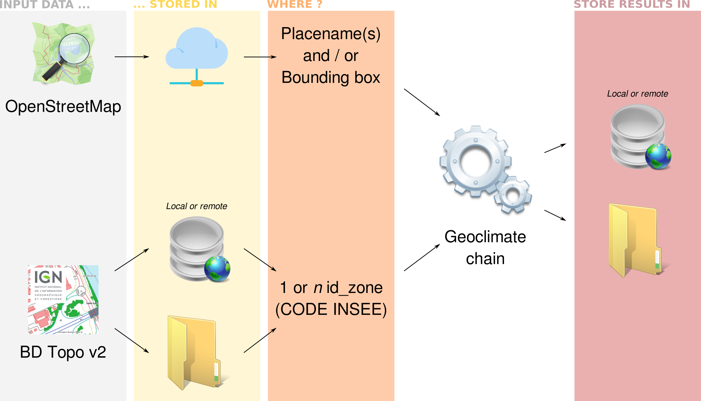

# Workflow Geoclimate

## Overview

A workflow is a dedicated script that makes possible to process a dataset from A to Z, while taking into account a series of parameters that the user is free to adjust. 

According to these choices, the user will obtain resulting tables whose contents may vary.

We present all these aspects below.


### Input dataset

Currently, the Geoclimate workflow is made to process two kind of input datasets:

- [OpenStreetMap (OSM)](./osm/intro.md)
- [BD Topo v2](./bd_topo_v2/intro.md) from the french [IGN](http://www.ign.fr/)


### Applications

The Geoclimate workflow can be executed for 3 types of application:

- `TEB` : all the indicators needed to feed the [TEB](https://opensource.umr-cnrm.fr/projects/teb) model from Météo France
- `LCZ` : all the indicators needed to compute the LCZ classification
- `URBAN_TYPOLOGY` : all the indicators needed to compute the urban typology developed by The [LRA](http://lra.toulouse.archi.fr/lra) (Toulouse, France)

These options can be inclusive (2 or 3 in the same time) or exclusive (just 1).


### Parameters

When executing the workflow, the user is able to adjust some parameters, that will have a direct impact on the results. Below are listed these parameters, with a description and when necessary a default value.

|           Parameter            | Description                                                  |          Default value           |
| :----------------------------: | ------------------------------------------------------------ | :------------------------------: |
|            `expand`            | Distance (expressed in meters) used to select the objects that will feed the chain |              `1000`              |
|         `dist_buffer`          | Distance (expressed in meters) used to filter buildings and roads around the zone |              `500`               |
|           `hLevMin`            | Indicates the theoretical minimum height (in meters) of a building level |               `3`                |
|           `hLevMax`            | Indicates the theoretical maximum height (in meters) of a building level |               `15`               |
|        `hThresholdLev2`        | Indicates the theoretical maximum height (in meters) of a building level, where the parameter `Nb_lev_rule`  = 2 (Type = commercial) |               `10`               |
|       `sky_view_factor`        | Value used to weight the SVF parameter in the LCZ classification (between 0 and 1) |               `1`                |
|         `aspect_ratio`         | ... Aspect ratio parameter ...                               |               `1`                |
|  `building_surface_fraction`   | ... Building surface fraction parameter ...                  |               `1`                |
| `impervious_surface_fraction`  | ... Impervious surface fraction parameter ...                |               `1`                |
|  `pervious_surface_fraction`   | ... Pervious surface fraction parameter ...                  |               `1`                |
| `height_of_roughness_elements` | ... Height of roughness elements parameter ...               |               `1`                |
|   `terrain_roughness_class`    | ... Terrain roughness class parameter ...                    |               `1`                |
|        `svfSimplified`         |                                                              |             `false`              |
|          `prefixName`          | Prefix used to name the output tables                        |                                  |
|         `indicatorUse`         | Specify whether the user want to execute the chain for the LCZ and/or TEB and/or Urban typology | ["LCZ", "URBAN_TYPOLOGY", "TEB"] |


### Outputs

As a result, 5 potential output tables are produced. Their structure may vary according to the application parameters chosen when executing the workflow.

To know more about these output tables, read [this page](./outputs.md).


## And technically

### The process

The Geoclimate workflow is a groovy file stored [here](https://github.com/orbisgis/geoclimate/blob/v1.0.0-RC1/processingchain/src/main/groovy/org/orbisgis/geoclimate/processingchain/Workflow.groovy).

In this file, the two dataset use cases are translated into two processes :

- [OSM](https://github.com/orbisgis/geoclimate/blob/v1.0.0-RC1/processingchain/src/main/groovy/org/orbisgis/geoclimate/processingchain/Workflow.groovy#L1540)
- [BDTOPO_V2](https://github.com/orbisgis/geoclimate/blob/v1.0.0-RC1/processingchain/src/main/groovy/org/orbisgis/geoclimate/processingchain/Workflow.groovy#L131)

When we will run the geoclimate workflow, we will use one of these two processes.

### Configuration file

The parameters, needed by the process, are stored in an independent configuration file. This way, the user has just to adapt this file instead of changing some things in the workflow groovy file, which may be a bit too complex for non-experts.

Currently, there is 9 (`.json`) configuration files, that can be used to run Geoclimate with the two input datasets (see [OSM](https://github.com/orbisgis/geoclimate/tree/master/osm/src/test/resources/org/orbisgis/geoclimate/osm/config) and [BD Topo V2](https://github.com/orbisgis/geoclimate/tree/master/bdtopo_v2/src/test/resources/org/orbisgis/geoclimate/bdtopo_v2/config)).

Depending on the input dataset, these configuration files allows the user to "play" various scenarios which can be summarized with the illustration below.





In details, below are listed the different possibilities offered by this files:

For [OSM](https://github.com/orbisgis/geoclimate/tree/master/osm/src/test/resources/org/orbisgis/geoclimate/osm/config)


- [osm_workflow_envelope_folderoutput.json](https://github.com/orbisgis/geoclimate/blob/master/osm/src/test/resources/org/orbisgis/geoclimate/osm/config/osm_workflow_envelope_folderoutput.json) 
- [osm_workflow_mixedfilter_folderoutput.json](https://github.com/orbisgis/geoclimate/blob/master/osm/src/test/resources/org/orbisgis/geoclimate/osm/config/osm_workflow_mixedfilter_folderoutput.json) 
- [osm_workflow_placename_dboutput.json](https://github.com/orbisgis/geoclimate/blob/master/osm/src/test/resources/org/orbisgis/geoclimate/osm/config/osm_workflow_placename_dboutput.json) 
- [osm_workflow_placename_folderoutput.json](https://github.com/orbisgis/geoclimate/blob/master/osm/src/test/resources/org/orbisgis/geoclimate/osm/config/osm_workflow_placename_folderoutput.json)

For [BD Topo V2](https://github.com/orbisgis/geoclimate/tree/master/bdtopo_v2/src/test/resources/org/orbisgis/geoclimate/bdtopo_v2/config)


- [bdtopo_workflow_dbinput_dboutput.json](https://github.com/orbisgis/geoclimate/blob/master/bdtopo_v2/src/test/resources/org/orbisgis/geoclimate/bdtopo_v2/config/bdtopo_workflow_dbinput_dboutput.json)
- [bdtopo_workflow_folderinput_dboutput.json](https://github.com/orbisgis/geoclimate/blob/master/bdtopo_v2/src/test/resources/org/orbisgis/geoclimate/bdtopo_v2/config/bdtopo_workflow_folderinput_dboutput.json) 
- [bdtopo_workflow_folderinput_folderoutput.json](https://github.com/orbisgis/geoclimate/blob/master/bdtopo_v2/src/test/resources/org/orbisgis/geoclimate/bdtopo_v2/config/bdtopo_workflow_folderinput_folderoutput.json) 
- [bdtopo_workflow_folderinput_folderoutput_id_zones.json](https://github.com/orbisgis/geoclimate/blob/master/bdtopo_v2/src/test/resources/org/orbisgis/geoclimate/bdtopo_v2/config/bdtopo_workflow_folderinput_folderoutput_id_zones.json)
- [bdtopo_workflow_folderinput_id_zones_folderoutput_tablenames.json](https://github.com/orbisgis/geoclimate/blob/master/bdtopo_v2/src/test/resources/org/orbisgis/geoclimate/bdtopo_v2/config/bdtopo_workflow_folderinput_id_zones_folderoutput_tablenames.json) 


Inside these configuration files, we have the following entries:

- **`description`** : a free text that described the configuration file
- **`geoclimatedb`** :  the part where we configure the "working" H2GIS database (db), used to execute the chain
  - `path` : the address where the the working db will be created (no need to create it before)
  - `delete` : if `true` (default value), the db will be removed at the end of the workflow. Write `false` if you want to keep this db.
- **`input`** : the part where the input informations are filled
  - for BD Topo v2:
    - Case with a `folder` : specify the address of the folder where the input files are stored. There will be as many cities processed as there are zone id (`id_zone` = CODE INSEE in France)  found in the `IRIS_GE` table.
    - Case with a `database` : you will have to fill the following informations
      - connexion informations: JDBC url, user, password
      - `tables` : for each of the needed tables, point out the tables with their respective schema (e.g `ign_bdtopo.bati_indifferencie`)
      - `id_zones` : the list of the zone id (`id_zone` = CODE INSEE in France) (between 1 and *n* id_zone)
  - for OSM,
    - a (list of) placename(s),
  - *or* a bounding box *(also called envelop or bbox)*, defined thanks to its coordinates (in Lat/Long - WGS84),
    - *or* a mix between placename(s) and bbox.
- **`output`** : the part where the output informations are filled. Choose to export in a:
  - `folder`: specify the address of the folder where the output files will be stored
  - or a `database`: fill the connexion informations: JDBC url, user, password
- **`parameters`** : all the parameter values described [here](#Parameters).

#### Example

Below is an example with the configuration file [bdtopo_workflow_folderinput_folderoutput.json](https://github.com/orbisgis/geoclimate/blob/master/bdtopo_v2/src/test/resources/org/orbisgis/geoclimate/bdtopo_v2/config/bdtopo_workflow_folderinput_folderoutput.json) 

```json
{
    "description" :"Example of configuration file with an input and output folder",
    "input" : {
        "folder": "/tmp/..."
    },
    "output" :{
     "folder" : "/tmp/..."},
    "parameters":
    {"distance" : 1000,
        "indicatorUse": ["LCZ", "URBAN_TYPOLOGY", "TEB"],
        "svfSimplified": false,
        "prefixName": "",
        "mapOfWeights":
        {"sky_view_factor": 1,
            "aspect_ratio": 1,
            "building_surface_fraction": 1,
            "impervious_surface_fraction" : 1,
            "pervious_surface_fraction": 1,
            "height_of_roughness_elements": 1,
            "terrain_roughness_class": 1},
        "hLevMin": 3,
        "hLevMax": 15,
        "hThresholdLev2": 10
    }
}
```


### Execute the workflow

Once you edited and adapted your configuration file to your needs, you are ready to run the Geoclimate workflow. To do so, the user as to adapt (by choosing the process `Geoclimate.Workflow.OSM()` or `Geoclimate.Workflow.BDTOPO_V2()` ) and execute the following groovy script (see how [here](../../for_users/execution_tools.md)).

```groovy
// Declaration of the maven repository
@GrabResolver(name='orbisgis', root='https://nexus.orbisgis.org/repository/orbisgis/')

// Declaration of our Nexus repository, where the geoclimate project is stored
@Grab(group='org.orbisgis.geoclimate', module='geoclimate', version='1.0.0-SNAPSHOT')

// Importing needed classes
// In the Geoclimate object, we already have all the classes that allow access to the processes
import Geoclimate

// We declare the tool that register and display the logs
Geoclimate.logger = logger

// The OSM or BD Topo v2 process is stored in a variable called "process" (and it instantiates the process at the same time).
// Choose one of these two following instructions, depending on your input dataset
def process = Geoclimate.Workflow.OSM()
// or
def process = Geoclimate.Workflow.BDTOPO_V2()

// We execute the process (OSM or BD Topo v2) using the only input parameter : the configuration file
process.execute(configurationFile:['your local configuration file adress'])
// example : process.execute(configurationFile:'/tmp/osm_workflow_placename_folderoutput.json')
                   
// Ask to display the logs (can be useful to see the progress of the process.)
logger.info process.results.outputMessage
```


## Use cases

Want to see Geoclimate in action?! Two use cases are presented below with data coming from: 
- [OpenStreetMap (OSM)](./osm/intro.md)
- [BD Topo v2](./bd_topo_v2/intro.md) from the french IGN


