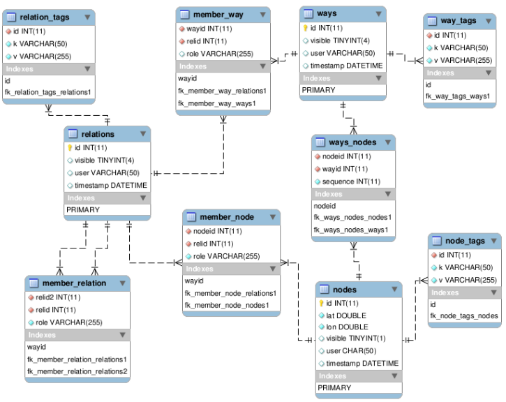

# OSM workflow

## Context

This workflow has been developed within the [URCLIM](http://www.urclim.eu/) research project, funded by the European Union.
It allows to extract and transform OSM data into a set of GIS layers 
that respect the input data model.
Then the GIS layers are processed to compute geoclimate indicators.

## The OpenStreetMap database

OSM is a relational data model (Figure 1). Real-world objects are modelled under three types of primitive elements: 
Node, Way (a set of nodes connected to each other) and Relation (an ordered list of nodes, ways or other relations). 
The node is the main element and stores the geographical coordinates (exprimed in latitude-longitude). 
It is the hinge that maintains the relationship between objects. For example, it is necessary to recover all the nodes 
of a way in order to be able to reconstruct its geometry and position it in space. In terms of semantics, the information 
that qualifies the objects are modelled in the form of tags composed of a “key=value” pair1. 
Although there are recommendations established by the OSM community, there is no fixed and constrained framework for 
describing objects : OSM semantics is based on a folksonomy (Hombiat, 2017), allowing both a richness in terms of information 
but also a great heterogeneity in terms of completeness and logical consistency. 
Real-world objects that need to be integrated into the GeoClimate chain can therefore have several descriptions 
and several types of modelizations in OSM database. For example, a building can be represented by a way but the information 
indicating that it is a church can be contained in a node which is not linked to this way. 
In another case, a building and the information indicating that it is a church are all contained in one object that is a way. 
In the first case, the church will be described by the tag "amenity=church", while in the second case, 
it will be described by the tag "building=church". In order to recover the most exhaustive data set possible for a 
study area with regards to the information required to feed the GeoClimate chain, it is necessary to transform OSM data.

Figure 1. OpenStreetMap data model (Hombiat A., 2017)

Raw OSM data is not built in layered GIS format : it consists on a unique file distributed in .osm format 
(encoded in XML language) or in .pbf format (compressed format). All objects types (nodes, ways and relations) 
are stored together in this file. Data is therefore not separated into GIS layers as it is the case for traditional 
GIS encodings where one layer is generally designed to hold only one type of geometric feature (points, lines or polygons). 
Furthermore, objects and their associated informations are not tabulated in columns, which can be another difficulty 
to manipulate the data. 
OSM community already offers database extractions in GIS layered formats. eg [OSMnx](https://github.com/gboeing/osmnx),
[bbbike](https://extract.bbbike.org/), [Geofabrik](https://www.geofabrik.de/), [GéoDataMine](https://geodatamine.fr/)

However, most of the time, these are simplified by the mapping processes from raw OSM data format to GIS format, 
leading to a loss of informations. Even if there are some advanced tools like [overpass API](https://wiki.openstreetmap.org/wiki/Overpass_API) to extract OSM data on demand,
the callback-driven style of programming didn't feel very comfortable, especially for the end user such as a climate specialist.

As a consequence, a methodology has been developed to extract and format OSM data to a set of GIS layers, compliant with 
the geoclimate input data model. 
The method has been implemented on top of the OrbisData library as a set of individual processes that could be chained. 
A dedicated library to extract and transform OSM data to GIS layers, called OSM has been developed. 
It can be used to extract from a bounding box area or a place name any OSM features and transform it into point, 
line or polygon. The library is available at https://github.com/orbisgis/orbisanalysis/tree/master/osm

## Workflow description

The OSM worflow is organized in two tasks : 

- Extract and transform to GIS layers --> [Data preparation](./data_preparation.md)
- Formating to input data model --> [Data formating](./data_formating.md)

## The configuration files

A json file is used to configure the OSM workflow.

Four examples of OSM configuration files are available on the Geoclimate Github repository [here](https://github.com/orbisgis/geoclimate/tree/master/processingchain/src/test/resources/org/orbisgis/orbisprocess/geoclimate/processingchain/config):

1. [Using an envelop and exporting in a folder](https://github.com/orbisgis/geoclimate/blob/master/processingchain/src/test/resources/org/orbisgis/orbisprocess/geoclimate/processingchain/config/osm_workflow_envelope_folderoutput.json) 
2. [Using mixed filters and exporting in a folder](https://github.com/orbisgis/geoclimate/blob/master/processingchain/src/test/resources/org/orbisgis/orbisprocess/geoclimate/processingchain/config/osm_workflow_mixedfilter_folderoutput.json)
3. [Using a placename and exporting in a database](https://github.com/orbisgis/geoclimate/blob/master/processingchain/src/test/resources/org/orbisgis/orbisprocess/geoclimate/processingchain/config/osm_workflow_placename_dboutput.json)
4. [Using a placename and exporting in a folder](https://github.com/orbisgis/geoclimate/blob/master/processingchain/src/test/resources/org/orbisgis/orbisprocess/geoclimate/processingchain/config/osm_workflow_placename_folderoutput.json)

## Bibliography

Hombiat, A. (2017). OF4OSM : un méta-modèle pour structurer la folksonomie d'OpenStreetMap en une nouvelle ontologie. 
Informatique. Université Grenoble Alpes. https://tel.archives-ouvertes.fr/tel-01683028