# Run Geoclimate with BD Topo v2

As seen in [this section](../../chain_documentation/workflow/osm/coupling_with_geoclimate.md), five BD Topo v2 workflow configuration files are available on the Geoclimate Github repository [here](https://github.com/orbisgis/geoclimate/tree/master/processingchain/src/test/resources/org/orbisgis/orbisprocess/geoclimate/processingchain/config):

1. [Using an input database and saving results into a database](https://github.com/orbisgis/geoclimate/blob/master/processingchain/src/test/resources/org/orbisgis/orbisprocess/geoclimate/processingchain/config/bdtopo_workflow_dbinput_dboutput.json)
2. [Using an input folder and saving results into a database](https://github.com/orbisgis/geoclimate/blob/master/processingchain/src/test/resources/org/orbisgis/orbisprocess/geoclimate/processingchain/config/bdtopo_workflow_folderinput_dboutput.json) 
3. [Using an input folder and saving results into a folder](https://github.com/orbisgis/geoclimate/blob/master/processingchain/src/test/resources/org/orbisgis/orbisprocess/geoclimate/processingchain/config/bdtopo_workflow_folderinput_folderoutput.json) 
4. [Using an input folder with a filtering on the zone id and saving results into a folder](https://github.com/orbisgis/geoclimate/blob/master/processingchain/src/test/resources/org/orbisgis/orbisprocess/geoclimate/processingchain/config/bdtopo_workflow_folderinput_folderoutput_id_zones.json) 
5. [Using an input folder with a filtering on the zone id and saving results into a folder where table names are specifyed](https://github.com/orbisgis/geoclimate/blob/master/processingchain/src/test/resources/org/orbisgis/orbisprocess/geoclimate/processingchain/config/bdtopo_workflow_folderinput_id_zones_folderoutput_tablenames.json)


Below are illustrated the cases [n°3](#Using-all-available-zones) and n°4 (with [1](#Using-a-zone-id) or [various](#Using-various-zone-ids) zone ids) in the [DBeaver](../execution_tools.md#With-DBeaver) environment.


## Using all available zones

With this workflow, we want to process a set of zones, regardless of their number and without the need to list them by hand as input parameters. Geoclimate will just scan the `IRIS_GE.shp` file and automatically detect the list of zones to be processed.

### 1. Context

In this example, we want to deal with all the cities present on a given territory (6 cities in the department of [Loire-Atlantique](https://www.openstreetmap.org/relation/7432) (44), on the south of Nantes, illustrated below).

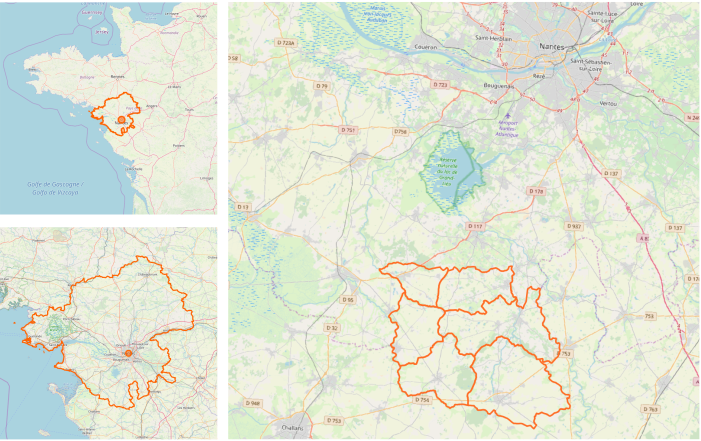

We assume that the necessary 12 [input layers](../../chain_documentation/workflow/bd_topo_v2/data_preparation.md#Input-layers) are stored as `.shp` files in the folder `/home/geoclimate/bdtopo/input/my_project/`.

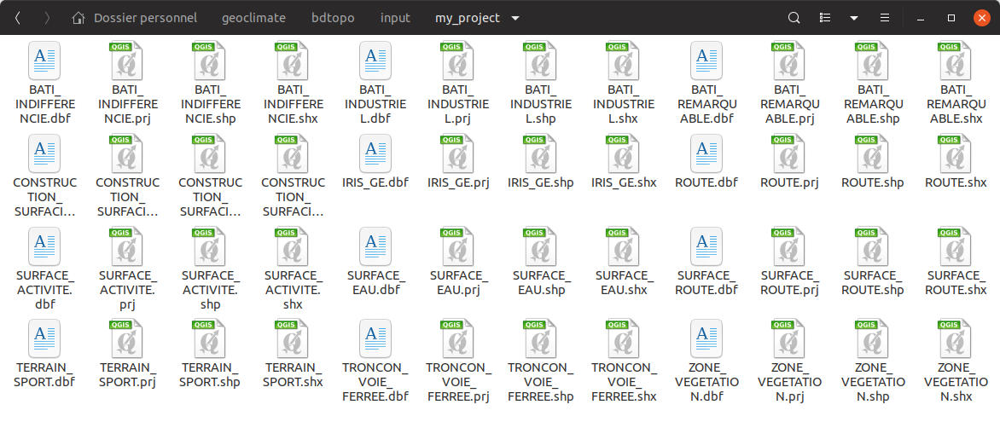


The resulting layers will be saved as `.geojson` files in this folder  `/home/geoclimate/bdtopo/output/`.

### 2. Configuration file

Download [this configuration file](https://github.com/orbisgis/geoclimate/blob/master/processingchain/src/test/resources/org/orbisgis/orbisprocess/geoclimate/processingchain/config/bdtopo_workflow_folderinput_folderoutput.json) and save it the folder  `/home/geoclimate/bdtopo/` with this name `config_all_zones.json`. Then open it in a text editor and:

1. In the `geoclimatedb` part, adapt the working database address (*e.g* `"path" : "/home/geoclimate/bdtopo/db/geoclimate_db;AUTO_SERVER=TRUE",`)
2. In the `input` part, replace `"path" :"/tmp/..."` by `"path" :"/home/geoclimate/bdtopo/input/my_project/"`
3. In the `output` part, replace `"folder" : "/tmp/..."},` by `"folder" : "/home/geoclimate/bdtopo/output/"},`
4. In the `parameters` part, replace `"indicatorUse": ["TEB"]` by `"indicatorUse": ["LCZ", "URBAN_TYPOLOGY", "TEB"]`
5. Save these modifications.

```json
{
    "description" :"Process many cities using BD Topo v2",
    "geoclimatedb" : {
        "path" : "/home/geoclimate/bdtopo/db/geoclimate_db;AUTO_SERVER=TRUE",
        "delete" :true
    },
    "input" : {
        "folder": "/home/geoclimate/bdtopo/input/my_project/"}
    },
    "output" :{
        "folder" : "/home/geoclimate/bdtopo/output/"},
    "parameters":
    {"distance" : 1000,
        "indicatorUse": ["LCZ", "URBAN_TYPOLOGY", "TEB"],
        "svfSimplified": false,
        "prefixName": "",
        "mapOfWeights":
        {"sky_view_factor": 1,
            "aspect_ratio": 1,
            "building_surface_fraction": 1,
            "impervious_surface_fraction" : 1,
            "pervious_surface_fraction": 1,
            "height_of_roughness_elements": 1,
            "terrain_roughness_class": 1},
        "hLevMin": 3,
        "hLevMax": 15,
        "hThresholdLev2": 10
    }
}
```

### 3. DBeaver

Launch DBeaver and open a new Groovy console (if not already installed, please follow these [instructions](../execution_tools.md)).

As explained [before](../../chain_documentation/workflow/description.md#And-technically) we will execute the `BDTOPO_V2` process, which is in the workflow groovy file : `geoclimate.workflow.BDTOPO_V2()`

So, in the Groovy console, copy and paste the following script

```groovy
@GrabResolver(name='orbisgis', root='https://nexus.orbisgis.org/repository/orbisgis/')
@Grab(group='org.orbisgis.orbisprocess', module='geoclimate', version='1.0.0-RC1')

import org.orbisgis.orbisprocess.geoclimate.Geoclimate
Geoclimate.logger = logger

def process = Geoclimate.Workflow.BDTOPO_V2()
process.execute(configurationFile:'/home/geoclimate/bdtopo/config_all_zones.json')
                   
logger.info process.results.outputMessage
```

Where `'/home/geoclimate/bdtopo/config_all_zones.json'` is the place where the configuration file is stored.

Then, click on  to execute the workflow.

### 4. Results

In your output folder `/home/geoclimate/bdtopo/output/` you now have as many sub-folders as there are cities processed. In our example, there are 6 new sub-folders called `bdtopo_v2_44081`, `bdtopo_v2_44083`, `bdtopo_v2_44090`, `bdtopo_v2_44156`, `bdtopo_v2_44157` and `bdtopo_v2_44206` in which are stored the resulting layers, saved as `.geojson` files. 

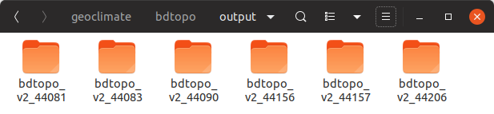


These files can be opened in most of the GIS applications (e.g [QGIS](https://www.qgis.org/), [OrbisGIS](http://orbisgis.org/), [OpenJUMP](http://www.openjump.org/), ...).

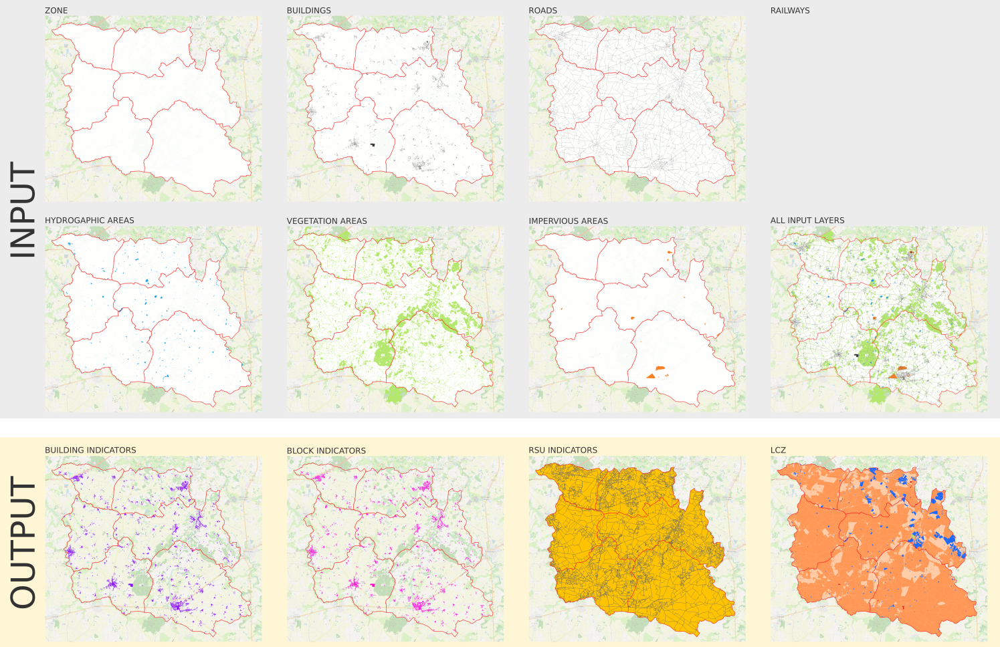

Remark: in this sample data set, there were no railways.

#### Warning

Cities were processed independently of each other. As a result, you will have redundant objects at the city limits. Indeed, as [seen here](../../chain_documentation/workflow/outputs.md#Buildings-inside-or-outside-the-study-area), the input (and resulting) buildings are selected (and returned) in a certain radius around the city.

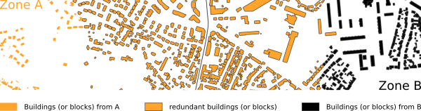

So if you want to merge layers from the different cities into one single, and avoid duplicated objects, you should remove all the buildings with the following values :

- in the `INPUT_BUIDLING` table, where the column `id_zone` = `outside`
- in the `BUILDING_INDICATORS` or `BLOCK_INDICATORS` table, where the column `id_rsu` is null

[Back to top](#Run-Geoclimate-with-BD-Topo-v2)


## Using a zone id

With this workflow, we want to process a specific zone, using its `id_zone`. Before lauching the all chain, Geoclimate will read the `IRIS_GE.shp` file in order to check whether the desired `id_zone` is present or not. If not, the process will stop.

### 1. Context

In this example, we want to process the french city of [Nantes](https://www.openstreetmap.org/relation/59874) (`id_zone` = CODE INSEE = 44109).

We have layers from BD Topo v2, on the department of [Loire-Atlantique](https://www.openstreetmap.org/relation/7432) (44) where Nantes is the capital. 

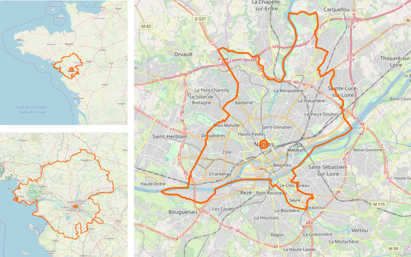


The 12 [input layers](../../chain_documentation/workflow/bd_topo_v2/data_preparation.md#Input-layers) are stored as `.shp` files in the folder `/home/geoclimate/bdtopo/input/44/`.

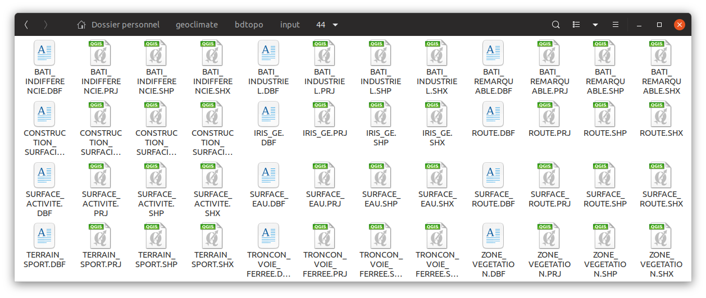

The resulting layers will be saved as `.geojson` files in this folder  `/home/geoclimate/bdtopo/output/`.

### 2. Configuration file

Download [this configuration file](https://github.com/orbisgis/geoclimate/blob/master/processingchain/src/test/resources/org/orbisgis/orbisprocess/geoclimate/processingchain/config/bdtopo_workflow_folderinput_folderoutput_id_zones.json) and save it the folder  `/home/geoclimate/bdtopo/` with this name `config_id_zone.json`. Then open it in a text editor and:

1. In the `geoclimatedb` part, adapt the working database address (*e.g* `"path" : "/home/geoclimate/bdtopo/db/geoclimate_db;AUTO_SERVER=TRUE",`)
2. In the `input` part, 
   1. replace `"path" :"/tmp/..."` by `"path" :"/home/geoclimate/bdtopo/input/44/"`
   2. replace `id_zones":["id zone here"]` by `id_zones":["44109"]`
3. In the `output` part, replace `"folder" : "/tmp/..."},` by `"folder" : "/home/geoclimate/bdtopo/output/"},`
4. In the `parameters` part, replace `"indicatorUse": ["TEB"]` by `"indicatorUse": ["LCZ", "URBAN_TYPOLOGY", "TEB"]`
5. Save these modifications.

```json
{
    "description" :"Process BD Topo v2 on the city of Nantes",
    "geoclimatedb" : {
        "path" : "/home/geoclimate/bdtopo/db/geoclimate_db;AUTO_SERVER=TRUE",
        "delete" :true
    },
    "input" : {
        "folder": {"path" :"/home/geoclimate/bdtopo/input/44/",
            "id_zones":["44109"]}
    },
    "output" :{
     "folder" : "/home/geoclimate/bdtopo/output/"},
    "parameters":
    {"distance" : 1000,
        "indicatorUse": ["LCZ", "URBAN_TYPOLOGY", "TEB"],
        "svfSimplified": false,
        "prefixName": "",
        "mapOfWeights":
        {"sky_view_factor": 1,
            "aspect_ratio": 1,
            "building_surface_fraction": 1,
            "impervious_surface_fraction" : 1,
            "pervious_surface_fraction": 1,
            "height_of_roughness_elements": 1,
            "terrain_roughness_class": 1},
        "hLevMin": 3,
        "hLevMax": 15,
        "hThresholdLev2": 10
    }
}
```


### 3. DBeaver

As seen before, launch DBeaver, open a new Groovy console and execute the following script

```groovy
@GrabResolver(name='orbisgis', root='https://nexus.orbisgis.org/repository/orbisgis/')
@Grab(group='org.orbisgis.orbisprocess', module='geoclimate', version='1.0.0-RC1')

import org.orbisgis.orbisprocess.geoclimate.Geoclimate
Geoclimate.logger = logger

def process = Geoclimate.Workflow.BDTOPO_V2()
process.execute(configurationFile:'/home/geoclimate/bdtopo/config_id_zone.json')
                   
logger.info process.results.outputMessage
```

Where `'/home/geoclimate/bdtopo/config_id_zone.json'` is the place where the configuration file is stored.

Then, click on  to execute the workflow.


### 4. Results

In your output folder `/home/geoclimate/bdtopo/output/` you now have a new sub-folder called `bdtopo_v2_44109` in which are stored the resulting layers, saved as `.geojson` files. In particular, you have:

- the 7 input layers (`INPUT_BUILDING`, `INPUT_ROAD`, `INPUT_RAILS`, `INPUT_VEGET`, `INPUT_HYDRO`, `INPUT_IMPERVIOUS` and `ZONE`)
- the 4 resulting layers (`BUILDING_INDICATORS`, `BLOCK_INDICATORS`, `RSU_INDICATORS`, `RSU_LCZ`)

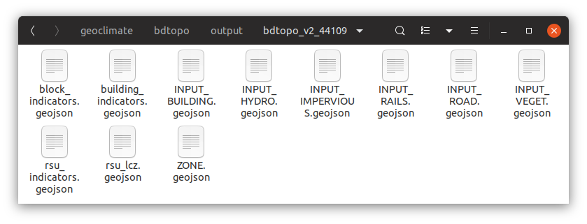

These files can be opened in most of the GIS applications (e.g [QGIS](https://www.qgis.org/), [OrbisGIS](http://orbisgis.org/), [OpenJUMP](http://www.openjump.org/), ...).

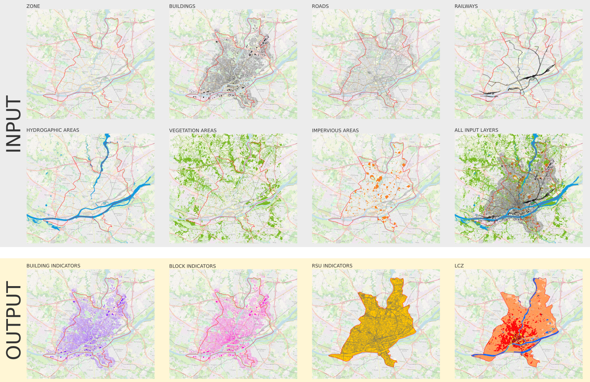


[Back to top](#Run-Geoclimate-with-BD-Topo-v2)

## Using various zone ids

### 1. Context

In this example, instead of dealing with [just one city](#Using-a-zone-id), we want to process several cities in the same time.

Here, the studied cities are Nantes (`id_zone` = 44109), Orvault (`id_zone` = 44114), Saint-Herblain (`id_zone` = 44162) and Sainte-Luce-sur-Loire (`id_zone` = 44172).

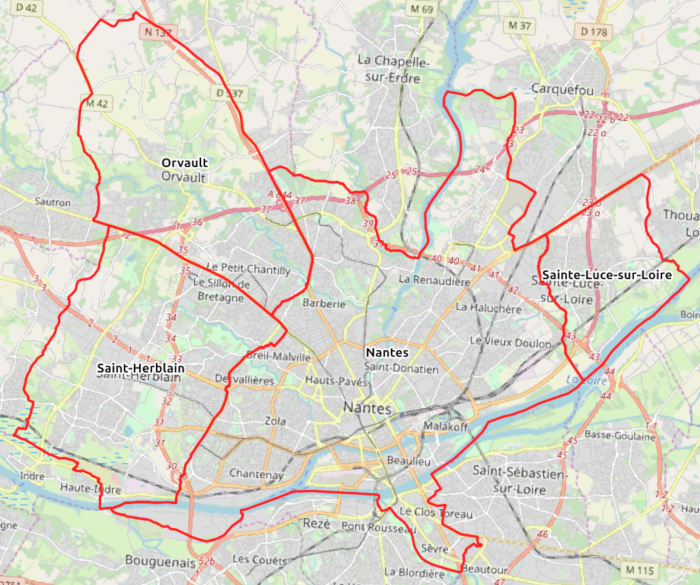


The working database, the input data folder and the output folder will be placed in the same place as in the previous example.

- Working db : `/home/geoclimate/bdtopo/db/geoclimate_db`
- Input data folder : `/home/geoclimate/bdtopo/input/44/`
- Output data folder : `/home/geoclimate/bdtopo/output/`

### 2. Configuration file

In the configuration file used in the [previous example](#Using-a-zone-id), just adapt the `input` part by completing the list of  `id_zones` like this:

```json
    "input" : {
        "folder": {"path" :"/home/geoclimate/bdtopo/input/44/",
            "id_zones":["44109", "44114", "44162", "44172"]}
    }
```

### 3. DBeaver

As seen before, launch DBeaver, open a new Groovy console and execute the following script

```groovy
@GrabResolver(name='orbisgis', root='https://nexus.orbisgis.org/repository/orbisgis/')
@Grab(group='org.orbisgis.orbisprocess', module='geoclimate', version='1.0.0-RC1')

import org.orbisgis.orbisprocess.geoclimate.Geoclimate
Geoclimate.logger = logger

def process = Geoclimate.Workflow.BDTOPO_V2()
process.execute(configurationFile:'/home/geoclimate/bdtopo/config_id_zone.json')
                   
logger.info process.results.outputMessage
```

Where `'/home/geoclimate/bdtopo/config_id_zone.json'` is the place where the configuration file is stored.

Then, click on  to execute the workflow.

### 4. Results

In your output folder `/home/geoclimate/bdtopo/output/` you now have 4 new sub-folders called `bdtopo_v2_44109`, `bdtopo_v2_44114`, `bdtopo_v2_44162` and `bdtopo_v2_44172` in which are stored the resulting layers, saved as `.geojson` files. 

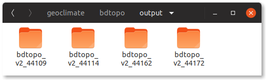

Below are presented some resulting layers, on the 4 studied cities

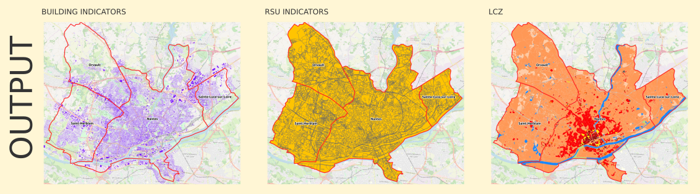


#### Reminder

Cities were processed independently of each other. As a result, you will have redundant objects at the city limits. [Read more](#Warning)


[Back to top](#Run-Geoclimate-with-BD-Topo-v2)