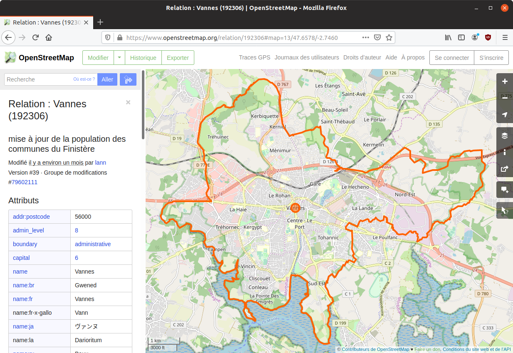

# Run Geoclimate with OSM

As seen in [this section](../../chain_documentation/workflow/osm/coupling_with_geoclimate.md), four OSM workflow configuration files are available on the Geoclimate Github repository [here](https://github.com/orbisgis/geoclimate/tree/master/processingchain/src/test/resources/org/orbisgis/orbisprocess/geoclimate/processingchain/config):

1. [Using an envelop and exporting in a folder](https://github.com/orbisgis/geoclimate/blob/master/processingchain/src/test/resources/org/orbisgis/orbisprocess/geoclimate/processingchain/config/osm_workflow_envelope_folderoutput.json) 
2. [Using mixed filters and exporting in a folder](https://github.com/orbisgis/geoclimate/blob/master/processingchain/src/test/resources/org/orbisgis/orbisprocess/geoclimate/processingchain/config/osm_workflow_mixedfilter_folderoutput.json)
3. [Using a placename and exporting in a database](https://github.com/orbisgis/geoclimate/blob/master/processingchain/src/test/resources/org/orbisgis/orbisprocess/geoclimate/processingchain/config/osm_workflow_placename_dboutput.json)
4. [Using a placename and exporting in a folder](https://github.com/orbisgis/geoclimate/blob/master/processingchain/src/test/resources/org/orbisgis/orbisprocess/geoclimate/processingchain/config/osm_workflow_placename_folderoutput.json)


Below are illustrated the cases n°4 and n°1, in the DBeaver environment.

## Using a placename

In this use case, we want to process OSM input data, extracted from the french city (placename) of [Vannes](https://www.openstreetmap.org/relation/192306). 



The resulting layers will be exported as flat files in a dedicated output folder at the following address : `/home/geoclimate/osm/`

### 1. Configuration file

Download this file : [osm_workflow_placename_folderoutput.json](https://github.com/orbisgis/geoclimate/blob/master/processingchain/src/test/resources/org/orbisgis/orbisprocess/geoclimate/processingchain/config/osm_workflow_placename_folderoutput.json) and open it in a text editor.

```json
{
    "description" :"Conf file to run the OSM workflow and store the resultst in a folder",
    "geoclimatedb" : {
        "path" : "/tmp/.../geoclimate_db;AUTO_SERVER=TRUE",
        "delete" :true
    },
    "input" : {
        "osm" : ["kerfot", "plouezec"]},
    "output" :{
     "folder" : "/tmp/..."},
    "parameters":
    {"distance" : 1000,
        "indicatorUse": ["LCZ", "URBAN_TYPOLOGY", "TEB"],
        "svfSimplified": false,
        "prefixName": "",
        "mapOfWeights":
        {"sky_view_factor": 1,
            "aspect_ratio": 1,
            "building_surface_fraction": 1,
            "impervious_surface_fraction" : 1,
            "pervious_surface_fraction": 1,
            "height_of_roughness_elements": 1,
            "terrain_roughness_class": 1},
        "hLevMin": 3,
        "hLevMax": 15,
        "hThresholdLev2": 10
    }
}
```

Then:

1. In the `geoclimatedb` part, adapt the output database address (*e.g* `"path" : "/home/geoclimate/osm/db/geoclimate_db;AUTO_SERVER=TRUE",`)
2. In the `input` part, replace `"kerfot", "plouezec"` by `"vannes"`
3. In the `output` part, replace `"folder" : "/tmp/..."},` by `"folder" : "/home/geoclimate/osm/"},`
4. Save these modifications.


### 2. DBeaver

Launch DBeaver and open a new Groovy console (if not already installed, please follow these [instructions](../execution_tools.md)).

As explained before we will execute the OSM process, which is in the workflow groovy file : `geoclimate.workflow.OSM()`

So, in the Groovy console, copy and paste the following script

```groovy
@GrabResolver(name='orbisgis', root='https://nexus.orbisgis.org/repository/orbisgis/')
@Grab(group='org.orbisgis.orbisprocess', module='geoclimate', version='1.0.0-SNAPSHOT')

import org.orbisgis.orbisprocess.geoclimate.Geoclimate
Geoclimate.logger = logger

def process = Geoclimate.Workflow.OSM()
process.execute(configurationFile:'/home/geoclimate/osm/osm_workflow_placename_folderoutput.json')
                   
logger.info process.results.outputMessage
```

Where `'/home/geoclimate/osm/osm_workflow_placename_folderoutput.json'` is the place where the configuration file is stored.

Then, click on  to execute the workflow.

## Using a bbox

### 1. Configuration file

Download this file : [osm_workflow_envelope_folderoutput.json](https://github.com/orbisgis/geoclimate/blob/master/processingchain/src/test/resources/org/orbisgis/orbisprocess/geoclimate/processingchain/config/osm_workflow_envelope_folderoutput.json) and open it in a text editor.

```json
{
  "description" :"Configuration file to run the OSM workflow with an output folder",
  "geoclimatedb" : {
        "path" : "/tmp/.../geoclimate_db;AUTO_SERVER=TRUE",
        "delete" :true
    },
  "input" : {
     "osm":[[38.89557963573336,-77.03930318355559,38.89944983078282,-77.03364372253417]]},
  "output" :{
     "folder" : "/tmp/..."},
  "parameters":
    {"distance" : 1000,
        "indicatorUse": ["LCZ", "URBAN_TYPOLOGY", "TEB"],
        "svfSimplified": false,
        "prefixName": "",
        "mapOfWeights":
        {"sky_view_factor": 1,
            "aspect_ratio": 1,
            "building_surface_fraction": 1,
            "impervious_surface_fraction" : 1,
            "pervious_surface_fraction": 1,
            "height_of_roughness_elements": 1,
            "terrain_roughness_class": 1},
        "hLevMin": 3,
        "hLevMax": 15,
        "hThresholdLev2": 10
    }
}
```

Then:

1. In the `geoclimatedb` part, adapt the output database address (*e.g* `"path" : "/home/geoclimate/osm/db/geoclimate_db;AUTO_SERVER=TRUE",`)
2. In the `input`  / `osm` part, adapt the coordinates of your bounding box
3. In the `output` part, replace `"folder" : "/tmp/..."},` by `"folder" : "/home/geoclimate/osm/"},`
4. Save these modifications.


### 2. DBeaver

Launch DBeaver and open a new Groovy console (if not already installed, please follow these [instructions](../execution_tools.md)).

As explained before we will execute the OSM process, which is in the workflow groovy file : `geoclimate.workflow.OSM()`

So, in the Groovy console, copy and paste the following script

```groovy
@GrabResolver(name='orbisgis', root='https://nexus.orbisgis.org/repository/orbisgis/')
@Grab(group='org.orbisgis.orbisprocess', module='geoclimate', version='1.0.0-SNAPSHOT')

import org.orbisgis.orbisprocess.geoclimate.Geoclimate
Geoclimate.logger = logger

def process = Geoclimate.Workflow.OSM()
process.execute(configurationFile:'/home/geoclimate/osm/osm_workflow_envelope_folderoutput.json.json')
                   
logger.info process.results.outputMessage
```

Where `'/home/geoclimate/osm/osm_workflow_envelope_folderoutput.json.json'` is the place where the configuration file is stored.

Then, click on  to execute the workflow.


## Script to be executed in DBeaver

```groovy
// Declaration of the maven repository
@GrabResolver(name='orbisgis', root='https://nexus.orbisgis.org/repository/orbisgis/')

// Declaration of our Nexus repository, where the geoclimate project is stored
@Grab(group='org.orbisgis.orbisprocess', module='geoclimate', version='1.0.0-SNAPSHOT')

// Importing needed classes
// In the Geoclimate object, we already have all the classes that allow access to the processes
import org.orbisgis.orbisprocess.geoclimate.Geoclimate

// We declare the tool that register and display the logs
Geoclimate.logger = logger

// The OSM process is stored in a variable called "process" (and it instantiates the process at the same time)
def process = Geoclimate.Workflow.OSM()

// We execute the process (OSM) using the only input parameter : the configuration file
process.execute(configurationFile:['your local configuration file adress'])
// example : process.execute(configurationFile:'/tmp/osm_workflow_placename_folderoutput.json')
                   
// Ask to display the logs (can be useful to see the progress of the process.)
logger.info process.results.outputMessage
```


