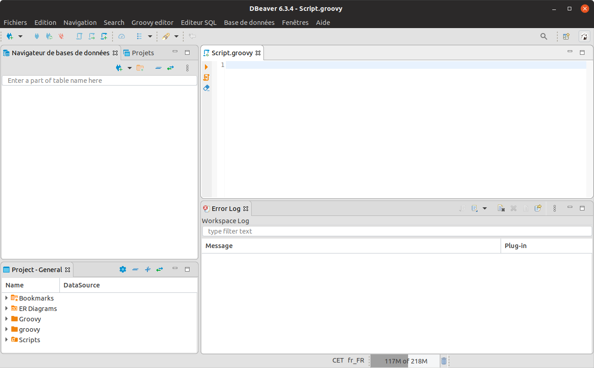

# Execution tools

You can execute the Geoclimate chain in many ways. Below are presented two simple (and free of charge) options.

## With the Groovy Console

Step by step tutorial with screenshots and command lines

## With DBeaver

[DBeaver](https://dbeaver.io/) is a free and opensource multi-platform database tool to query, explore and manage data. Since the 6.2.2 version, DBeaver support the [H2GIS](http://h2gis.org/)-[H2 database](https://www.h2database.com/) engine. 

User is able to create a H2GIS database, query and display spatial objects from a friendly user interface (see https://twitter.com/H2GIS/status/1181566934548176897).

To use Geoclimate scripts in DBeaver, user must install the **Groovy Editor** developed by the [OrbisGIS](http://orbisgis.org/) / [H2GIS](http://h2gis.org/) team.

In DBeaver:

1. Go to the Main menu `Help` -> `Install New Software...`
2. In the `Work with` field, paste the following URL http://devs.orbisgis.org/eclipse-repo (which is an extension P2 repository URL) and press `Enter`
3. Select `Groovy Editor` item
4. Click `Next` -> `Finish` and Restart DBeaver.

Once DBeaver has restarted, select the main menu `Groovy Editor`, clic on `Open editor`, then you will have a Groovy Console. 

Copy-paste the previous script to use Geoclimate. If you want to log the message of the processes into DBeaver, you must add `Geoclimate.logger = logger` just after the imports.

## Use cases

Below are presented two step-by-step documentations to execute the OSM and BD Topo v2 workflows

- [OSM](./execution_examples/run_osm.md)
- [BD Topo v2](./execution_examples/run_bd_topo_v2.md)
