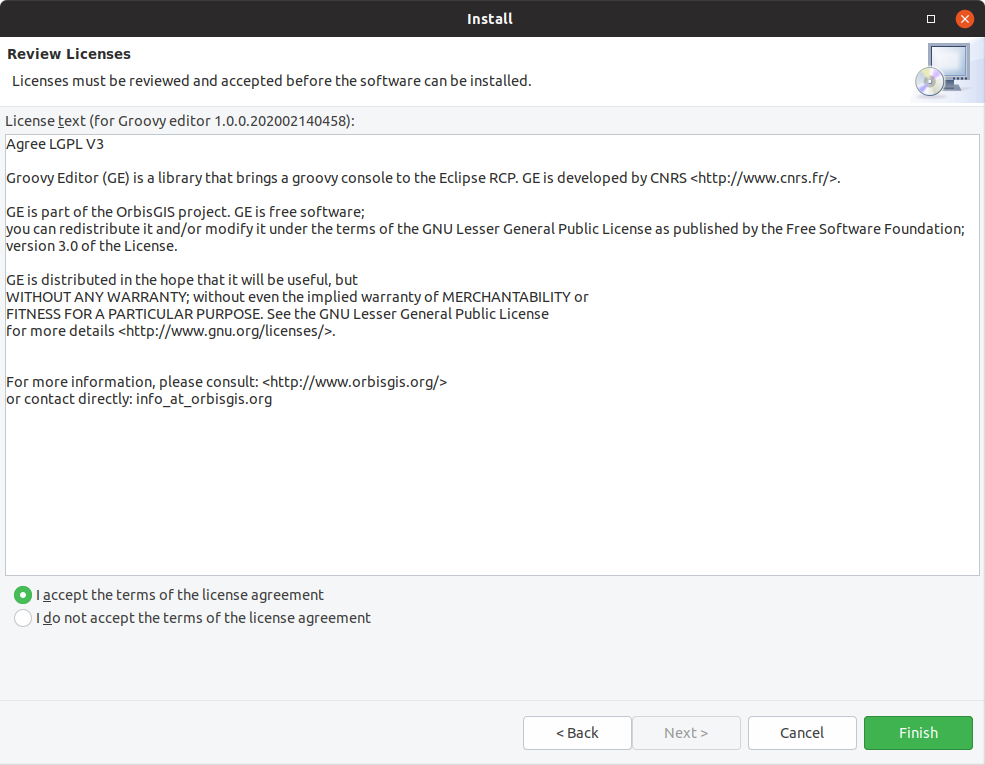
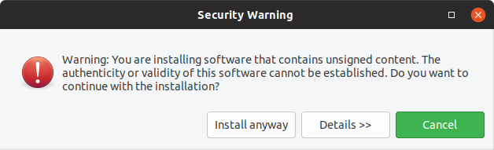
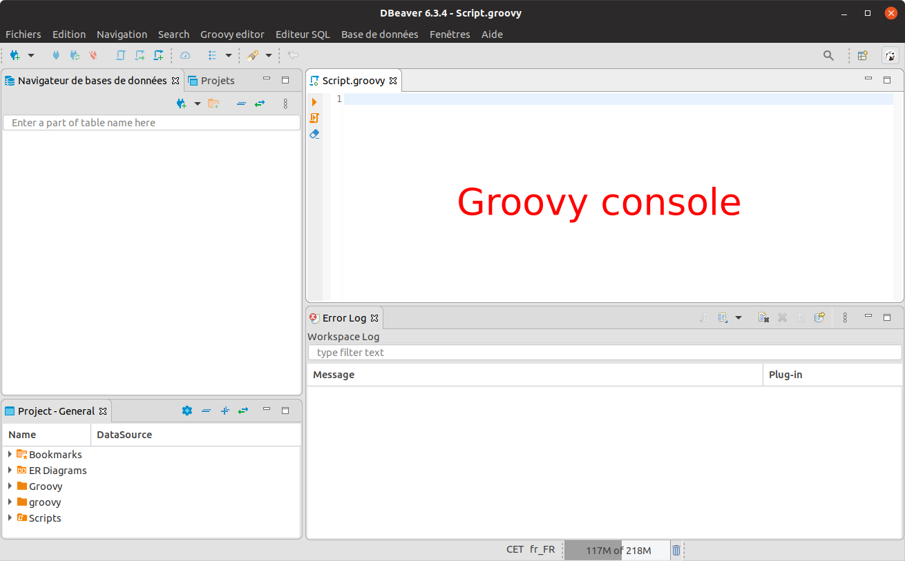
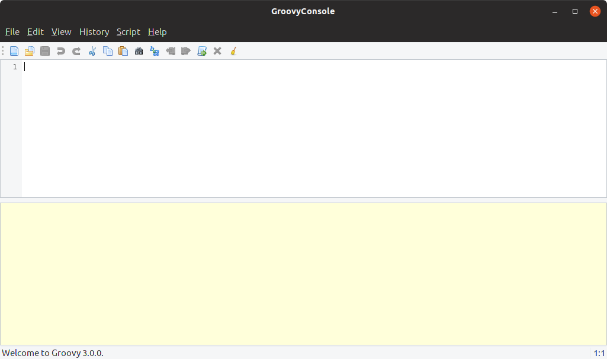

# Scripting consoles

You can execute the Geoclimate chain in many ways. Below are presented two simple (and free of charge) options:

- With [DBeaver](#With DBeaver)
- With the [Groovy console](#With the Groovy Console)

Don't forget that Geoclimate is developed in Groovy language and Groovy needs a Java Virtual Machine (JVM).
It requires at least Java 8.

Go to [OpenJDK](https://openjdk.java.net/).


## With DBeaver

[DBeaver](https://dbeaver.io/) is a free and opensource multi-platform database tool to query, explore and manage data. Since the 6.2.2 version, DBeaver support the [H2GIS](http://h2gis.org/)-[H2 database](https://www.h2database.com/) engine. 

User is able to create a H2GIS database, query and display spatial objects from a friendly user interface (see https://twitter.com/H2GIS/status/1181566934548176897).


To use Geoclimate scripts in DBeaver, user must install the **Groovy Editor** and the **H2GIS 2.0 driver**, developed by the Geoclimate team.

In DBeaver:

1. Go to the Main menu `Help` -> `Install New Software...`
2. In the `Work with` field, paste the following URL http://devs.orbisgis.org/eclipse-repo (which is an extension P2 repository URL) and press `Enter`
3. Check the `OrbisGIS` item (in the sub-list, the `Groovy Editor` and the `H2GIS driver` should be selected too)
4. Click `Next` -> `Finish` and Restart DBeaver.


------

### Remarks

#### Accept the license

You may be asked to accept the open license ([LGPL v3](https://www.gnu.org/licenses/lgpl-3.0.en.html)) of the `Groovy Editor` and the `h2gis_driver` . If so, check on `I accept the terms of the licence agreement` and click on `Finish`.




#### Security warning

You also may have a `Security Warning` since these two "plugins" are not officially developed by the DBeaver team. So you are asked to confirm the installation by clicking on `Install anyway`.



------


Once DBeaver has restarted, select the main menu `Groovy Editor`, click on `Open editor`, then you will have a Groovy Console.




|                             Icon                             |              Action               |
| :----------------------------------------------------------: | :-------------------------------: |
|  | Execute the selected instructions |
|  |      Execute all the console      |
|  |         Clear the console         |


Now you are ready to play with the Geoclimate chain by executing the dedicated scripts introduced below in the use cases.


## With the Groovy Console


### Install the Groovy console

The console is included in Groovy distribution. Please check the Groovy do to install it :
 https://groovy-lang.org/install.html

### Launch the console

In a terminal, just enter `groovyConsole` and press Enter.

```bash
$ groovyConsole
```

The following interface should appear



Once you loaded (or copy/pasted) your script, you can execute it by clicking on  (or by using the shortcut `Ctrl + R`).


## Use cases

Below are presented two step-by-step documentations to execute the OSM and BD Topo v2 workflows

- [OSM](./execution_examples/run_osm.md)
- [BD Topo v2](./execution_examples/run_bd_topo_v2.md)
