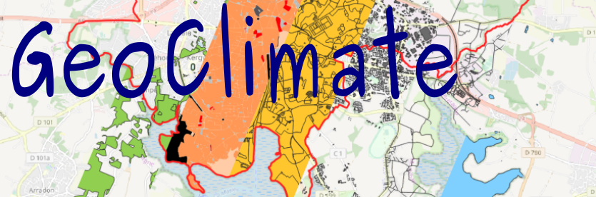

.. Geoclimate documentation master file, created by
   sphinx-quickstart on Wed Oct 21 14:44:00 2020.
   You can adapt this file completely to your liking, but it should at least
   contain the root `toctree` directive.

Geoclimate documentation
==========================================

This is the **official Geoclimate documentation**.

The climate modelling is based on the type, the use and the shape of the studied area. At the urban scale, the type of land surface (pervious, impervious), the shape and the distribution of the buildings and the streets as well as the building use are the determinant parameters affecting the urban climate. Thus it is necessary to described accurately the urban fabric in order to apply the right energy balance.

Geoclimate is a `Groovy <http://groovy-lang.org/>`_ library that implements algorithms to compute geospatial indicators (e.g. density of building, skyview factor, building compactness, road distance, ...) based on vector `GIS <https://en.wikipedia.org/wiki/Geographic_information_system>`_ layers.

The geospatial indicators are computed at three spatial units:

- the building,
- the block, defined as an aggregation of buildings that are in contact,
- the Reference Spatial Unit (RSU).

More than 60 urban indicators are yet available. At a first stage, those indicators have been selected:

- to feed the `TEB <http://www.umr-cnrm.fr/spip.php?article199>`_ climate model developed by `Météo France <http://www.meteofrance.com>`_,
- to classify the urban tissues and build the Local Climate Zones (`LCZ <http://www.wudapt.org/lcz/>`_).

Even if Geoclimate has been developed for climate studies, the indicators can be used for other topics such as landscape ecology, land use, habitat conservation planning or any environmental or territory applications.

It can be freely used either for research and education, as well as by experts in a professional use.

This library is distributed under `GPL 3 license`_ by the DECIDE GIS team of the `Lab-STICC`_ (CNRS).

-  to **contribute to GeoClimate** please visit the code source repository : https://github.com/orbisgis/geoclimate
-  to **contact members of the team**, use the email info@orbisgis.org or let an issue : https://github.com/orbisgis/geoclimate/issues

**Fundings**

*Research projects:*

The Geoclimate library has been developed within the two following research projects:

- `URCLIM`_ , part of ERA4CS, a project initiated by JPI Climate and co-funded by the European Union under grant agreement No 690462
- PAENDORA , funded by `ADEME`_

*Institutional (public) fundings:*

- `CNRS`_

.. note::
    - The official documentation is available in English only.
    -  If you observe some mistakes or errors, please contact us at info@orbisgis.org or let an issue `here`_.
    -  You are welcome to contribute, improve the documentation
	 

.. _here: https://github.com/orbisgis/geoclimate/issues

.. _GPL 3 license: https://www.gnu.org/licenses/gpl-3.0.fr.html

.. _URCLIM: http://urclim.prod.lamp.cnrs.fr/

.. _ADEME: https://www.ademe.fr/

.. _CNRS: https://www.cnrs.fr/

.. _Lab-STICC: https://www.labsticc.fr/

