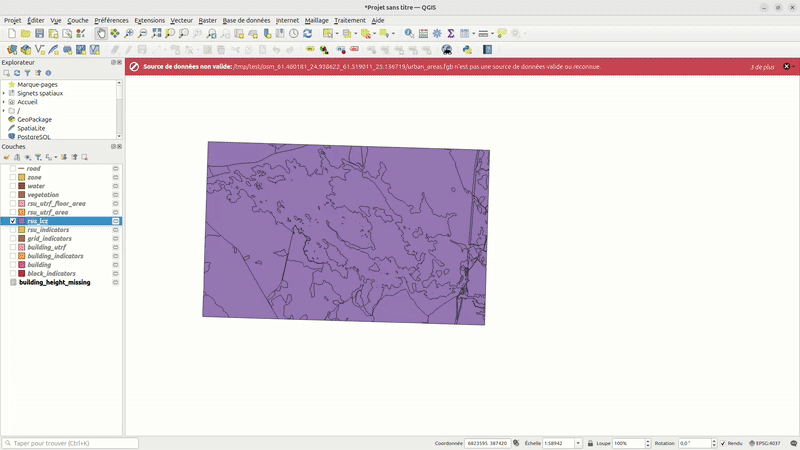

View data with DBeaver
======================

Display output with QGIS
------------------------

You can display the generated database with Dbeaver. To do this : - Open
QGIS - Open the folder that contains the outputs - Open the folder that
contains the output and drag and drop its content into qgis

.. figure:: ressources/show_data_tutorial/import.gif

Tweak the displayed layers
~~~~~~~~~~~~~~~~~~~~~~~~~~

To change the layers displayed, you anc, on the left, check or uncheck
boxes of each layers to display or hide them. You can also change the
order of the layers by changing where is the layer in the layers’
hierarchy.

.. figure:: ressources/show_data_tutorial/layers_manipulation.gif

If you want to display well the RSU_LCZ layer, we recommend to apply the
style
`rsu_lcz_primary.sld `__
on it. To apply it, download the file, and then on the layer, righ
click, then go in “properties”, click on the button “style” at the
popup’s bottom and then click on “Load style”. Then in as a load style
select “From a file” and click on the button below with “…” and select
your file. Finally, click on the “load style” button at the bottom of
the page, and the style will be applied.

Display database content with Dbeaver
-------------------------------------

You can view the generated database using DBeaver. To do this: - Open
DBeaver and create a new connection using the H2GIS Embedded driver. -
Select the .mv.db file generated by GeoClimate, located in the output
folder (*/tmp/test* in the example below). - Set the username to sa and
leave the password field empty. - Click Finish to establish the
connection and browse the database.

.. figure:: ressources/show_data_tutorial/create_connexion.gif

Now, you can display the content of every table of the database. If you
click on a cell that contains a geometry, it will display it on an
Openstreetmap background as in the picture bellow.

.. figure:: ressources/show_data_tutorial/geometry_dbeaver.png

.. include:: _Footer.rst
